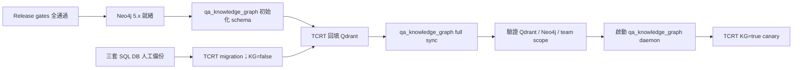

# Server Migration Runbook：`eaec105` → `d0b5401`（含 Neo4j）

- 文件日期：2026-07-29
- 狀態：**Draft / NO-GO**
- 伺服器基準：`eaec105920153ba5d9fba3ea4cee9664ff713af3`
- 分析目標：`d0b54013717941e285bafdef8d2686508979afb9`
- Neo4j 同步服務候選版本：`qa_knowledge_graph@611134d72da7ec72caef466b6d4fa05c09f71878`
- 範圍：只包含上述兩個 TCRT commit 之間的**已提交差異**；不包含任何本機未提交檔案。

> 本文件是執行計畫，不是 production 變更授權。任何 production DB、Neo4j schema、Qdrant、服務或設定的 mutation，都必須先取得該步驟的明確核准。

## 1. 結論與固定策略

採用「**先部署但停用 Knowledge Graph，再回填，最後才啟用**」的分階段遷移。

唯一允許的順序如下：

1. 修完所有 NO-GO 項目並產生新的 `RELEASE_COMMIT`。
2. 在 staging 以相同 DB engine 完整 rehearsal，含回復演練。
3. 準備 Neo4j 5.x、Qdrant 與 `qa_knowledge_graph`，但先不啟動長駐同步。
4. 備份 Neo4j（既有 instance）後初始化並驗證 Neo4j schema。
5. 將 TCRT 設為 `KNOWLEDGE_GRAPH_ENABLED=false`。
6. 停止 production 寫入，人工備份 main、audit、USM 三套 SQL DB。
7. 安裝包含 `knowledge` extra 的 TCRT release，執行 SQL migration。
8. 先以 Knowledge Graph 關閉狀態啟動 TCRT，完成核心功能 smoke test。
9. 維持寫入凍結，使用 TCRT CLI 將 TestCase、USM 回填到 Qdrant。
10. 使用 `qa_knowledge_graph` 執行 Qdrant → Neo4j full sync。
11. 驗證 schema、維度、數量、team scope 與健康狀態。
12. 啟動 `qa_knowledge_graph` daemon。
13. 最後才將 TCRT 切為 `KNOWLEDGE_GRAPH_ENABLED=true`，重啟並做 canary。

不得把第 9～13 步提早，也不得直接執行 `git pull && restart`。



## 2. 低階模型執行規則

執行者必須遵守以下規則：

1. 一次只執行一個有編號步驟；確認預期結果後才勾選。
2. 每步記錄：UTC 時間、命令、exit code、非敏感摘要、操作者。
3. 任一命令非零、輸出與本文件不同、或需要猜測值時，立即標記 `STOP`，不得自行變更順序或補指令。
4. 不得讀出、貼出或寫入 deployment log：密碼、token、完整 DB URL、`.env*`、`config.yaml`、key 內容。
5. 只可記錄 secret 的「是否存在」及 secret manager reference，不可記錄值。
6. 不得使用 `git reset --hard`、`git clean`、force push、Alembic downgrade、Neo4j `reset_database()`、刪除 Qdrant collection，除非另有明確且精確的人工核准。
7. production 寫入凍結期間，不得解除 maintenance mode，直到第 13 步完成或 rollback 完成。
8. 命令仍含 `REPLACE_ME` 時不得執行。

## 3. 已確認的版本差異

`eaec105..d0b5401` 是直系祖先關係，共 33 commits；差異為 674 files、66,881 insertions、7,885 deletions。

### 3.1 Runtime 相依性

- 新增 optional extra：`knowledge`。
- `pyproject.toml` 宣告 `neo4j>=5.20`、`qdrant-client>=1.9`。
- `uv.lock` 實際鎖定 `neo4j==6.2.0`、`qdrant-client==1.18.0`。
- `mise.toml` 將 Python 固定為 `3.12.10`。
- TCRT 對 Neo4j 只做 read-only query；Neo4j schema 與寫入由獨立的 `qa_knowledge_graph` 負責。
- Knowledge Graph 預設關閉；關閉時不應連線 Qdrant、Neo4j 或 embedding provider。

### 3.2 SQL migration

升版前預期 revision：

| Target | `eaec105` 預期 revision |
|---|---|
| main | `8f1b2c3d4e5a` |
| audit | `4e8f3d57b312` |
| USM | `7bc2e5a91d44` |

升版後預期 revision：

| Target | `d0b5401` 預期 revision | 主要變更 |
|---|---|---|
| main | `b1c2d3e4f5a6` | Assistant tables、prompt/skill seed、tool result、turn team context |
| audit | `b1c2d3e4f506` | Audit envelope、`knowledge_query_logs`、MySQL MEDIUMTEXT catch-up |
| USM | `7bc2e5a91d44` | 無新增 revision |

不得只升 main DB。目標版 `database_init.py` 已要求 audit DB 必須存在 `knowledge_query_logs`。

### 3.3 資料流責任

```text
TCRT SQL DB ──TCRT backfill/event hook──> Qdrant
Qdrant ──qa_knowledge_graph──> Neo4j
TCRT ──read-only query──> Qdrant + Neo4j
```

因此：

- TCRT backfill **只寫 Qdrant**，不建立 Neo4j schema。
- `qa_knowledge_graph` 必須在 TCRT backfill 後再做 full sync。
- TCRT 不可取得 Neo4j schema/write credential。
- `qa_knowledge_graph` 不可使用 TCRT 的 read-only Neo4j credential。

## 4. NO-GO：上線前必須先排除

以下任一項未完成，`STATUS` 必須維持 `NO-GO`。

### G01 — Docker image 未安裝 `knowledge` extra

目標 commit 的 Dockerfile 仍是：

```dockerfile
RUN uv sync --frozen --no-dev
```

Docker 部署前，release commit 必須改為等價的：

```dockerfile
RUN uv sync --frozen --no-dev --extra knowledge
```

驗證 image，不可只驗證 host venv：

```bash
docker run --rm --entrypoint python "$TCRT_RELEASE_IMAGE" \
  -c 'import neo4j, qdrant_client; print("knowledge dependencies OK")'
```

預期：exit `0` 且只輸出 `knowledge dependencies OK`。

### G02 — Docker build context 可能帶入 secrets / local data

目標 `.dockerignore` 只明確忽略 `.env`，不足以涵蓋 `.env.docker`、`.env.*`、備份檔及 `data/`。Docker release 必須先補強 ignore 規則，且只從乾淨、專用的 release checkout build。

硬性要求：

- build context 內不得有 `.env*`、`config.yaml*`、key、DB、backup、attachment、report、`data/` runtime state。
- build 時 secret 檔尚未放進 release checkout。
- runtime secret 在 image build 完成後才由 secret manager / protected env file 注入。
- `docker compose up` 使用既有 image，禁止在含 runtime secret 的目錄執行 `--build`。

只檢查檔名，不得讀內容：

```bash
git status --short --untracked-files=all
git ls-files --others --ignored --exclude-standard
```

若看到 secret-like、DB、backup 或 runtime data 檔名，`STOP`；不得執行 `git clean`，改用新的乾淨 release checkout。

### G03 — `database_init.py` 的自動升版前備份已被暫停

目標 commit 中，`bootstrap_target()` 明確略過原有 `create_backup()` 區塊。即使設定 `BOOTSTRAP_BACKUP_MODE=required`，也不可假設會產生升版前備份。

硬性要求：

- 由 DB 平台或既有正式備份程序，人工備份 main、audit、USM 三個 target。
- 每份備份要有不可混淆的 backup ID、時間、engine/version、大小或 checksum。
- staging 必須完成一次 restore rehearsal。
- 未取得三份可回復備份證據，不得執行 `database_init.py`。

### G04 — 目標 commit 的 Knowledge 測試不是 hermetic

在不帶本機設定、清除 Neo4j/Qdrant/DB env 的 `d0b5401` 獨立副本中，已觀察到：

```text
205 passed, 4 skipped, 1 failed
FAILED test_knowledge_redteam.py::test_health_connects_when_enabled
```

該測試會因外部 `NEO4J_URI` 是否存在而改變結果。release commit 必須修正測試隔離；不得在 CI 偷塞假的 production-like URI 來掩蓋。

修正後必須通過：

```bash
uv run --frozen --extra knowledge pytest \
  app/testsuite/test_knowledge_*.py \
  app/testsuite/test_tools_knowledge.py \
  app/testsuite/test_auxiliary_db_migrations.py \
  app/testsuite/test_database_init.py -q
```

### G05 — OpenSpec 實作狀態尚未收斂

目標 commit 中：

- `log-knowledge-graph-queries` 的 full suite、Ruff、strict validation、自我審查仍未勾選。
- `cross-team-rag` 除工件外的實作／測試 tasks 仍未勾選。
- `integrate-knowledge-rag-engine` tasks 全部未勾選，但程式檔已存在，工件與實作狀態不一致。

release 前必須同步工件並通過：

```bash
openspec validate add-knowledge-graph-integration --strict
openspec validate integrate-knowledge-rag-engine --strict
openspec validate log-knowledge-graph-queries --strict
openspec validate cross-team-rag --strict
uv run ruff check .
uv run pytest app/testsuite -q
npm run lint
node scripts/check-i18n-coverage.mjs
```

### G06 — Knowledge runtime state 尚未持久化

TCRT backfill progress 預設在 `data/knowledge_backfill_progress.json`，embedding cache 預設在 `/tmp/embedding_cache.db`。`docker-compose.app.yml` 目前沒有 Knowledge 專用 persistent volume。

Docker release 必須新增持久化 state mount，並設定：

```text
KNOWLEDGE_BACKFILL_PROGRESS_PATH=<persistent mount>/knowledge_backfill_progress.json
EMBEDDING_CACHE_PATH=<persistent mount>/embedding_cache.db
```

`qa_knowledge_graph` 的 watermark 預設為相對路徑 `data/sync_state.json`。其 service `WorkingDirectory` / volume 必須持久化，且只能啟動一個 daemon instance。

### G07 — `qa_knowledge_graph` 沒有 production deployment manifest

候選 commit 有 CLI/daemon，但沒有 checked-in Dockerfile、Compose 或 systemd unit。上線前必須由 operator 填入並驗證：

- 確切安裝目錄與 commit。
- service manager 名稱與 start/stop/status 命令。
- secret 注入方式。
- persistent watermark 路徑。
- restart policy、log destination、單例保證。

不得用臨時 `nohup` 當 production daemon。

### G08 — Neo4j server/driver 相容性尚需 staging 證據

設計要求 Neo4j 5.x，但兩個 repo 的 lockfile 均解析到 Python driver `6.2.0`。不得只依賴版本範圍推測相容；staging 必須使用 production 相同的 Neo4j exact version，驗證 connectivity、DDL、full sync、read-only query 與 graceful degradation。

### G09 — Embedding 資料外送必須先通過隱私核准

TestCase 與 USM backfill 會把 title、steps、expected result、description 等文字送往設定的 embedding provider。若 provider 是外部服務，這是 production-like data egress。

硬性要求：

- 資料擁有者與資安確認該 provider、endpoint、region、retention 與傳輸方式可接收這類資料。
- 不得把 production credential 或資料內容放進測試輸出／deployment log。
- 若外部傳輸未獲核准，改用已核准的 self-hosted OpenAI-compatible embedding endpoint，或維持 Knowledge Graph 關閉。
- 核准紀錄與 provider secret reference 必須寫入 deployment ticket；不得把 secret 寫進本文件或 repo。

## 5. 執行前資料表（必填，不含 secret 值）

在 deployment ticket 填完下表；任一 `REPLACE_ME` 未替換即 `STOP`。

| Key | Value |
|---|---|
| `TCRT_BASE_COMMIT` | `eaec105920153ba5d9fba3ea4cee9664ff713af3` |
| `TCRT_TARGET_COMMIT` | `d0b54013717941e285bafdef8d2686508979afb9` |
| `TCRT_RELEASE_COMMIT` | `REPLACE_ME`；必須為 target 的 descendant 且包含 G01～G06 修正 |
| `QAKG_COMMIT` | `611134d72da7ec72caef466b6d4fa05c09f71878` 或經核准的新版本 |
| Deployment mode | `REPLACE_ME`：Docker / native，二選一 |
| TCRT service stop/start/status | `REPLACE_ME` |
| qa_knowledge_graph stop/start/status | `REPLACE_ME` |
| Main DB engine/version | `REPLACE_ME` |
| Audit DB engine/version | `REPLACE_ME` |
| USM DB engine/version | `REPLACE_ME` |
| Main/Audit/USM backup IDs | `REPLACE_ME`；三份 |
| Neo4j exact version / backup ID | `REPLACE_ME` |
| Qdrant exact version / snapshot ID | `REPLACE_ME` |
| TCRT image tag + immutable digest | `REPLACE_ME` |
| Maintenance window | `REPLACE_ME`，絕對日期與時區 |
| Rollback decision owner | `REPLACE_ME` |

Secret 僅填「secret manager reference」，不得填值：

- TCRT Neo4j read-only credential reference。
- `qa_knowledge_graph` Neo4j schema/write credential reference。
- Qdrant credential reference。
- Embedding provider credential reference。
- 三套 SQL DB credential reference。

執行本文件中的 shell command 前，先由表格填入下列非敏感變數：

```bash
TCRT_RELEASE_COMMIT='REPLACE_ME'
TCRT_RELEASE_IMAGE='REPLACE_ME'
test "$TCRT_RELEASE_COMMIT" != 'REPLACE_ME'
test "$TCRT_RELEASE_IMAGE" != 'REPLACE_ME'
```

任一 `test` 非零即 `STOP`。

## 6. Stage rehearsal（production 前必做）

### R01 — 建立 production-like staging

- 使用與 production 相同的 SQL engine major version。
- 使用與 production 相同的 Neo4j exact version、Qdrant exact version。
- 使用匿名化或合成資料；不得把 production secrets 複製到 staging。
- 使用確切的 `TCRT_RELEASE_COMMIT` 與 `QAKG_COMMIT`。

### R02 — 執行完整 runbook

逐步執行本文件第 7～13 節，記錄：

- 三套 SQL migration 各自耗時。
- TCRT TestCase / USM backfill 各自耗時與 processed count。
- `qa-sync sync all --full` 耗時與各 entity count。
- Neo4j index 進入 `ONLINE` 的時間。
- TCRT 停機／寫入凍結總時間。

production 維護窗必須大於 rehearsal 實測時間，再加至少 30% buffer。

### R03 — 回復演練

在 staging 完整執行第 14 節 rollback，確認：

- 三套 SQL DB 均可還原到升版前 revision。
- `eaec105` 可重新啟動。
- 核心登入、Team、TestCase、Test Run、USM 可用。
- Neo4j / Qdrant 新資料即使保留，也不會被舊版 TCRT 使用。

## 7. Release artifact 準備

### P01 — 驗證 commit lineage

在乾淨 release checkout 執行：

```bash
git rev-parse HEAD
git merge-base --is-ancestor \
  d0b54013717941e285bafdef8d2686508979afb9 \
  "$TCRT_RELEASE_COMMIT"
git status --short --untracked-files=all
```

預期：

- `HEAD` 等於已核准的 `TCRT_RELEASE_COMMIT`。
- ancestry command exit `0`。
- working tree 無輸出。

### P02 — 安裝並驗證相依套件

Native：

```bash
uv sync --frozen --no-dev --extra knowledge
uv run --frozen --extra knowledge python -c \
  'import neo4j, qdrant_client; print("knowledge dependencies OK")'
```

Docker：先確認 G01/G02，再從無 secret 的乾淨 build context 建 image，執行 G01 的 image import check，記錄 immutable digest。不得只使用 mutable `latest` 或 `local` tag 當 rollback 依據。

### P03 — Release gates

執行 G04、G05 全部命令。預期全部 exit `0`。不可跳過、xfail、新增 `noqa` 或關閉規則來取得綠燈。

### P04 — 驗證 `qa_knowledge_graph` artifact

在確切 `QAKG_COMMIT`：

```bash
uv sync --frozen
uv run --frozen pytest tests -q
uv run --frozen ruff check src tests
```

候選 commit `611134d` 的已觀察基準為 `6 passed` 且 Ruff 無診斷。production 前仍需 staging integration test；這 6 個 unit tests 不等於外部服務驗證。

## 8. 設定準備：先保持停用

### C01 — TCRT 設定鍵

以下值放在既有 secret/config 機制，不得 commit。第一階段固定保持 `false`：

```text
KNOWLEDGE_GRAPH_ENABLED=false
KNOWLEDGE_QUERY_LOG_ENABLED=false

NEO4J_URI=<Neo4j Bolt/neo4j URI>
NEO4J_USERNAME=<TCRT read-only user>
NEO4J_PASSWORD=<secret reference>
NEO4J_DATABASE=<database name>
NEO4J_MAX_CONNECTION_POOL_SIZE=50
NEO4J_CONNECTION_TIMEOUT=30

QDRANT_URL=<Qdrant URL>
QDRANT_API_KEY=<secret reference, if required>
QDRANT_TIMEOUT=30
QDRANT_COLLECTION_JIRA_REFERENCES=jira_references
QDRANT_COLLECTION_TEST_CASES=test_cases
QDRANT_COLLECTION_USM_NODES=usm_nodes

EMBEDDING_PROVIDER=<approved provider>
EMBEDDING_MODEL=<approved model>
EMBEDDING_DIMENSIONS=1024
EMBEDDING_API_KEY=<secret reference, if required>
EMBEDDING_BASE_URL=<approved endpoint, if required>
EMBEDDING_BATCH_SIZE=100
EMBEDDING_CONCURRENCY=<staging-tested value>

KNOWLEDGE_BACKFILL_BATCH_SIZE=100
KNOWLEDGE_BACKFILL_PROGRESS_PATH=<persistent state path>
EMBEDDING_CACHE_PATH=<persistent state path or none>
```

硬性檢查：

- `NEO4J_URI` 必須是 driver URI，不可使用 HTTP console URL。
- TCRT credential 必須是 read-only。
- 三個 collection name 必須與 `qa_knowledge_graph` 完全一致。
- `EMBEDDING_DIMENSIONS` 必須與既有 Qdrant collection vector size 一致；不一致即 `STOP`。
- 若 provider 為 `openrouter`，必須存在 embedding API key。
- `KNOWLEDGE_GRAPH_ENABLED=false` 時，缺少尚未注入的 Neo4j secret 不應阻止 TCRT 啟動。

### C02 — `qa_knowledge_graph` 設定

使用與 TCRT 不同的 protected env/service definition：

- `NEO4J_*`：schema/write credential。
- `QDRANT_*`：read credential。
- collection names 與 TCRT 相同。
- service working directory 中的 `data/sync_state.json` 必須持久化。
- 禁止使用程式內建的 placeholder password。

## 9. 準備 Neo4j 與同步服務

此階段會 mutation Neo4j。風險包括：刪除既有同名 legacy constraints/indexes、建立新 constraints 時因重複資料失敗、index 建立期間的資源負載。回復方式是還原本階段前的 Neo4j backup/snapshot；未確認 backup ID 前不得執行。

### N01 — 健康檢查（read-only）

以 `qa_knowledge_graph` 的 protected runtime env 執行 health check；只記錄 boolean，不輸出 URI 或帳密：

```bash
uv run --frozen python - <<'PY'
import asyncio
import logging

from src.config import settings
from src.sync.neo4j_client import Neo4jClient


async def main() -> None:
    logging.disable(logging.CRITICAL)
    client = Neo4jClient(settings.neo4j)
    try:
        healthy = await client.health_check()
    finally:
        await client.close()
    print("neo4j healthy" if healthy else "neo4j unhealthy")
    raise SystemExit(0 if healthy else 1)


asyncio.run(main())
PY
```

不得改用會把密碼出現在 process list 的 CLI 參數。

### N02 — 初始化 schema（需單獨核准）

先停止所有 `qa_knowledge_graph` daemon，確認只有一個 schema initializer。取得 Neo4j mutation 核准後，在 `qa_knowledge_graph` repo 執行：

```bash
uv run --frozen python - <<'PY'
import asyncio

from src.config import settings
from src.sync.neo4j_client import Neo4jClient


async def main() -> None:
    client = Neo4jClient(settings.neo4j)
    try:
        if not await client.health_check():
            raise SystemExit("STOP: Neo4j unhealthy before schema init")
        await client.init_schema()
        print("schema init command completed; run N03 verification")
    finally:
        await client.close()


asyncio.run(main())
PY
```

禁止呼叫 `reset_database()`。`init_schema()` 會記錄部分 DDL 錯誤但不一定回傳非零，因此 N02 顯示 completed 不代表成功，必須執行 N03。

### N03 — 驗證 schema（read-only）

```bash
uv run --frozen python - <<'PY'
import asyncio

from src.config import settings
from src.sync.neo4j_client import Neo4jClient

REQUIRED_CONSTRAINTS = {
    "constraint_jira_key",
    "constraint_jira_ticket_key",
    "constraint_testcase_id",
    "constraint_testcase_number",
    "constraint_usm_id",
    "constraint_usm_node_id",
    "constraint_usm_map_id",
    "constraint_testcase_set_id",
    "constraint_testcase_section_id",
    "constraint_team_name",
}
REQUIRED_INDEXES = {
    "idx_jira_updated_at",
    "idx_testcase_last_synced_at",
    "idx_usm_last_synced_at",
    "idx_usm_parent_id",
    "idx_usm_type",
    "idx_testcase_priority",
    "ft_jira_title",
    "ft_testcase_title",
    "ft_usm_title_desc",
}


async def main() -> None:
    client = Neo4jClient(settings.neo4j)
    try:
        constraints = await client.execute_query(
            "SHOW CONSTRAINTS YIELD name RETURN name"
        )
        indexes = await client.execute_query(
            "SHOW INDEXES YIELD name, state RETURN name, state"
        )
        constraint_names = {row["name"] for row in constraints}
        index_states = {row["name"]: row["state"] for row in indexes}
        missing_constraints = REQUIRED_CONSTRAINTS - constraint_names
        missing_indexes = REQUIRED_INDEXES - set(index_states)
        non_online = {
            name: index_states[name]
            for name in REQUIRED_INDEXES & set(index_states)
            if index_states[name] != "ONLINE"
        }
        if missing_constraints or missing_indexes or non_online:
            raise SystemExit(
                f"STOP: missing_constraints={sorted(missing_constraints)}, "
                f"missing_indexes={sorted(missing_indexes)}, "
                f"non_online={non_online}"
            )
        print("neo4j schema verified")
    finally:
        await client.close()


asyncio.run(main())
PY
```

預期：exit `0`、輸出 `neo4j schema verified`。若 index 尚在 `POPULATING`，等待並重跑 N03；不可重置 DB。

### N04 — Qdrant preflight（read-only）

以既有 Qdrant admin/monitoring 工具記錄三個 collection 的：存在性、point count、vector size、distance metric；不得輸出 payload。

判定：

- `jira_references` 若已存在，vector size 必須等於 `EMBEDDING_DIMENSIONS`。
- `test_cases` / `usm_nodes` 可不存在；TCRT backfill 會建立。
- 若任何既有同名 collection 維度不同，`STOP`，不得刪除或覆寫 collection。

## 10. SQL migration（Knowledge Graph 維持關閉）

此階段會 mutation production main、audit、USM DB。風險包括 schema migration 中斷、MySQL 大文字欄位變更、Assistant seed 不完整，以及三個 DB revision 不一致。回復方式是停止新版本、還原三份同一時間點的人工備份，再啟動 `eaec105`。

### D01 — 升版前 read-only preflight

在目前伺服器版與目前 runtime env 記錄：

```bash
git rev-parse HEAD
uv run alembic -c alembic.ini current
uv run alembic -c alembic_audit.ini current
uv run alembic -c alembic_usm.ini current
uv run python database_init.py --preflight
```

預期 commit 與 revision 必須符合第 3.2 節。不同即 `STOP`；不得 stamp 或猜測 migration 起點。

### D02 — 進入 maintenance / freeze writes

1. 從 load balancer 移除 TCRT 或切 maintenance mode。
2. 停止所有 TCRT worker、scheduler、automation background writer。
3. 確認沒有 active TCRT process 會寫 main、audit、USM DB。
4. 記錄 freeze start time。

### D03 — 建立並驗證人工備份

由 operator 使用第 5 節已核准的 DB 平台命令建立三份備份。此文件不猜測 production engine credential 或 restore 指令。

每個 target 必須記錄：

- backup ID/path（不得含 credential）。
- 成功時間、engine/version、大小或 checksum。
- restore rehearsal evidence。

三份都完成後才可繼續。

### D04 — 切換 release code/image，但保持 feature off

- 確認 runtime env 仍為 `KNOWLEDGE_GRAPH_ENABLED=false`。
- Native：使用 P02 已同步的 release venv。
- Docker：使用 P02 已驗證且有 immutable digest 的 image；不得在此時 rebuild。

### D05 — 執行 migration

在 release code 與 production runtime env：

```bash
uv run python database_init.py --preflight
uv run python database_init.py
uv run python database_init.py --verify-target all --json
uv run alembic -c alembic.ini current
uv run alembic -c alembic_audit.ini current
uv run alembic -c alembic_usm.ini current
```

預期 revision：

```text
main  b1c2d3e4f5a6
audit b1c2d3e4f506
usm   7bc2e5a91d44
```

任一 command 非零或 revision 不符，立即進入第 14 節完整 SQL rollback。不要讓 entrypoint 無限重試；目標版的自動 backup/rollback 不可用。

### D06 — 啟動 TCRT（feature off checkpoint）

啟動新版本，但維持 load balancer maintenance。驗證：

- `GET /health` 成功。
- 登入、首頁、Team、TestCase、Test Run、USM 的 read-only smoke test 成功。
- Admin Knowledge Health 顯示 `enabled=false`，且沒有對 Qdrant/Neo4j 的 outbound connection。
- log 無 `ModuleNotFoundError`、migration error、missing `knowledge_query_logs`、large-text gate error。

此 checkpoint 失敗，執行完整 SQL rollback，不進行 Qdrant backfill。

## 11. TCRT → Qdrant backfill

寫入仍須凍結。原因：feature off 時 production CRUD 不會可靠產生 Knowledge delta；若 backfill 期間允許寫入，可能遺漏更新或留下已刪除資料。目標版沒有可用來保證零停機 cutover 的 durable change capture。

本階段會讀取 production SQL 內容、呼叫 embedding provider，並 upsert Qdrant。主要風險是敏感文字外送、錯誤維度或錯誤 collection name 污染既有資料，以及中斷後狀態不一致。開始 B02 前必須完成 G09、取得 Qdrant snapshot ID，並確認 progress file 可回復。失敗時先保持 feature off、保留現場並 resume；若必須還原 Qdrant，僅能由 operator 依已核准 snapshot 程序執行，不得刪除 collection。

### B01 — 確認單例與 persistent state

- 只有一個 backfill process。
- progress 與 embedding cache 路徑可寫、位於 persistent storage。
- Qdrant / embedding provider health 正常。
- collection dimensions 通過 N04。

### B02 — 回填 TestCase

使用與 TCRT service 相同的 runtime env，只對該 CLI command 暫時覆寫 feature flag：

Native：

```bash
KNOWLEDGE_GRAPH_ENABLED=true \
uv run --frozen --extra knowledge \
python -m app.services.knowledge backfill --entity test_cases
```

Docker：entrypoint 會忽略自訂 command，因此使用已啟動、仍在 maintenance 的 app container：

```bash
docker compose --env-file .env.docker -f docker-compose.app.yml \
  exec -e KNOWLEDGE_GRAPH_ENABLED=true app \
  uv run python -m app.services.knowledge backfill --entity test_cases
```

預期：exit `0`，輸出 `status=completed`。若中斷，保留 progress file，修復原因後重跑同一命令；UUID point ID upsert 是 idempotent。不得清除 progress 或 collection。

### B03 — 回填 USM

Native：

```bash
KNOWLEDGE_GRAPH_ENABLED=true \
uv run --frozen --extra knowledge \
python -m app.services.knowledge backfill --entity usm_nodes
```

Docker：

```bash
docker compose --env-file .env.docker -f docker-compose.app.yml \
  exec -e KNOWLEDGE_GRAPH_ENABLED=true app \
  uv run python -m app.services.knowledge backfill --entity usm_nodes
```

預期同 B02。

### B04 — 驗證 Qdrant（read-only）

記錄：

- `test_cases`、`usm_nodes` collection 均存在。
- vector size 等於 `EMBEDDING_DIMENSIONS`。
- progress file 兩個 entity 均為 `completed`。
- processed count 與 SQL source count 差異有說明；空 embedding text 可能不產生 point，不可只看「非零」。
- 不檢視或輸出 payload 內容。

任一檢查失敗：保持 TCRT feature off 與 maintenance，修復／resume，不進入 Neo4j sync。

## 12. Qdrant → Neo4j full sync

### K01 — 執行 full sync

確認沒有 `qa_knowledge_graph` daemon 正在執行，然後在候選 repo 與 protected runtime env：

```bash
uv run --frozen qa-sync sync all --full
```

CLI 固定依序處理 Jira → TestCase → USM。預期 exit `0`，三者都有成功摘要。

### K02 — 驗證 graph（read-only）

至少驗證：

- N03 schema 仍完整且 index 全為 `ONLINE`。
- JiraTicket、TestCase、USMNode count 有非負且合理的數量。
- USM parent-child 關係可查。
- TestCase team_id 與 Qdrant source 一致。
- 用兩個不同 team 的 staging fixture 驗證 team isolation；不得以 production 敏感內容當測試關鍵字。
- full sync 重跑一次仍成功且不產生 duplicate unique node。

若 count 或 team scope 不一致，`STOP`；保持 TCRT feature off。不得用 `reset_database()` 修復。

### K03 — 啟動 daemon

用第 5 節已核准的 service manager 啟動唯一 daemon，實際 command 應等價於：

```bash
uv run --frozen qa-sync daemon
```

驗證：

- service status 為 active。
- 僅一個 instance。
- working directory 與 watermark file 位於 persistent storage。
- log 無 auth、connection、schema、watermark write error。
- daemon 第一次啟動只建立 count baseline 是預期行為；K01 full sync 不可省略。

## 13. 啟用 TCRT Knowledge Graph

### E01 — Canary 前設定變更

取得 feature-enable 核准後：

```text
KNOWLEDGE_GRAPH_ENABLED=true
KNOWLEDGE_QUERY_LOG_ENABLED=true
```

其餘 endpoint、collection、dimension 與 credential reference 不得在此步驟改動。重啟一個 canary TCRT replica；其他 replica 維持 feature off 或不接流量。

### E02 — Canary smoke test

驗證並只記錄去識別化摘要：

- `GET /health` 成功。
- 以已認證 Super Admin 呼叫 `/api/knowledge/health`：
  - `enabled=true`
  - overall `status=healthy`
  - Qdrant `healthy`
  - Neo4j `healthy`
  - TestCase / USM backfill `completed`
- 執行一筆已知、非敏感、team-scoped knowledge search。
- 搜尋結果不包含其他未授權 team 的資料。
- `knowledge_query_logs` 在 retention/redaction 規則下新增一筆，不記錄 secret。
- log 無 module import、dimension mismatch、Neo4j auth、Qdrant、embedding、background worker error。

API health response 含內部 endpoint 欄位，不得把完整 response 貼到公開或跨團隊 log；只記錄上述 status。

### E03 — 擴大流量

1. Canary 至少觀察 15 分鐘。
2. 若錯誤率、latency、外部服務連線池與 DB 指標正常，再逐步啟動其餘 replica。
3. 每批至少觀察 10 分鐘。
4. 全部 replica 健康後解除 maintenance / write freeze。
5. 記錄 freeze end time 與總停機時間。

### E04 — 上線後監控

至少監控 60 分鐘：

- TCRT `/health`、5xx、latency。
- Knowledge overall/degraded status。
- Qdrant / Neo4j / embedding error rate。
- `qa_knowledge_graph` daemon 與 watermark 更新。
- Knowledge task queue warning／shutdown timeout。
- Audit DB `knowledge_query_logs` flush error。
- SQL connection pool、CPU、memory。

## 14. Rollback / forward recovery

### 14.1 快速停用 Knowledge Graph（核心 app 正常時優先）

適用：Neo4j、Qdrant、embedding、資料完整性或 Knowledge latency 有問題，但核心 TCRT 正常。

1. 將 `KNOWLEDGE_GRAPH_ENABLED=false`、`KNOWLEDGE_QUERY_LOG_ENABLED=false`。
2. 逐一重啟 TCRT replica。
3. 停止 `qa_knowledge_graph` daemon（若問題與同步有關）。
4. 驗證 Admin Knowledge Health 為 disabled，且核心 smoke test 正常。
5. 保留 Qdrant collection、Neo4j data、progress、watermark 與 log 供分析；不得刪除。

這是 feature rollback，不需要還原 SQL DB。

### 14.2 完整 TCRT rollback（核心 app / migration 失敗）

適用：新版本核心功能失敗、schema 驗證失敗、資料寫入異常。

1. 維持 maintenance，停止所有新版本 TCRT process。
2. 停止 `qa_knowledge_graph` daemon。
3. 保留失敗現場的非敏感 log 與 revision/status evidence。
4. 由 operator 使用第 5 節已核准的 restore 命令，將 main、audit、USM **三套一起**還原到同一升版前時間點。
5. 切回 exact `eaec105920153ba5d9fba3ea4cee9664ff713af3` artifact/image。
6. 使用舊版 migration scripts 驗證 revision：main `8f1b2c3d4e5a`、audit `4e8f3d57b312`、USM `7bc2e5a91d44`。
7. 啟動舊版，完成核心 smoke test後才解除 maintenance。

不得只回退 code 而保留新 Alembic revision：舊版 script directory 不認得新 revision，entrypoint 可能無法啟動。不得在 incident 中用 Alembic downgrade 取代備份還原；main downgrade 會刪除 Assistant data，audit MySQL downgrade 也可能因超過 TEXT 64KB 而失敗。

### 14.3 Neo4j schema rollback

只在 N02 對既有共享 Neo4j 造成影響時使用：

1. 停止 TCRT Knowledge query 與 `qa_knowledge_graph`。
2. 取得精確 Neo4j restore 核准。
3. 由 Neo4j operator 還原 N02 前的 snapshot/backup。
4. 重跑 read-only health 與 schema inventory。

禁止使用 `reset_database()` 或手動 `DETACH DELETE` 當 rollback。

### 14.4 Forward recovery

若只有 Knowledge 外部服務失敗，建議保持新 TCRT code + 新 SQL schema、feature off，修復 Qdrant/Neo4j/embedding 後從 B01 重新開始。Qdrant upsert 與 `qa-sync --full` 可重跑；仍須保留原 progress/watermark 並先判讀失敗原因。

## 15. 完成條件

只有下列全部成立才可把 migration ticket 標為完成：

- [ ] G01～G09 全部有證據且 release status 為 GO。
- [ ] Staging rehearsal 與完整 rollback rehearsal 通過。
- [ ] 三套 production SQL backup 可回復。
- [ ] SQL revision 精確等於目標值。
- [ ] Qdrant TestCase / USM backfill 均 completed。
- [ ] Neo4j schema 完整、indexes ONLINE、full sync 成功。
- [ ] `qa_knowledge_graph` daemon 單例且 watermark 持久化。
- [ ] TCRT canary 與全量 replica 健康。
- [ ] Team isolation 驗證通過。
- [ ] 60 分鐘監控無 release-blocking error。
- [ ] Deployment log 不含任何 secret 或敏感 payload。

## 16. 本計畫的待確認項目

以下資訊無法只從 repo 判定，必須由 server operator 在執行前補齊：

- 實際 deployment mode、service manager 與目錄。
- 三套 SQL DB 的 engine/version 與正式 backup/restore 命令。
- Neo4j / Qdrant exact server version、拓撲、snapshot/restore 程序。
- production 可接受的 maintenance window。
- TCRT read-only 與 `qa_knowledge_graph` write credential 的 RBAC 實作方式。
- 經 staging 測得的 backfill/full-sync 時間與 embedding rate limit。
