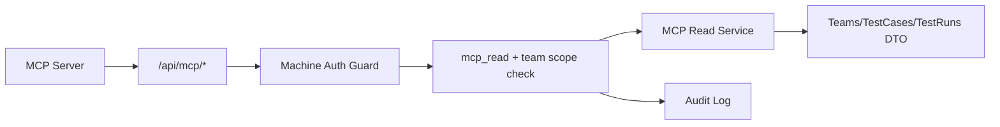

## Context

目前 TCRT 認證主路徑為使用者 JWT（`Authorization: Bearer <user-token>`），主要面向人類使用者與前端互動。  
MCP Server 屬於非互動式整合端，若沿用使用者登入流程，會造成憑證管理複雜、權限邊界不清楚，且難以做最小權限（least privilege）落實。  

本次設計要新增 machine principal（機器身分）與 `mcp_read` 權限，並提供 MCP 專用唯讀端點，避免沿用既有敏感 payload 與不完整授權檢查。

## Goals / Non-Goals

**Goals:**
- 提供 machine-to-machine 認證，不需互動式 UI 登入。
- 新增 `mcp_read` 權限語意與 team scope 限制。
- 提供 `/api/mcp/*` 唯讀資料模型，涵蓋 teams、test cases、test runs（含 set / unassigned / adhoc）。
- 確保敏感欄位不外洩並保留 audit trace。

**Non-Goals:**
- 不重做既有使用者 JWT 登入架構。
- 不改變既有前端 API 回傳契約。
- 不在本次導入 MCP 寫入能力（create/update/delete）。

## Decisions

### Decision 1: 採用 machine token（service account）資料表與驗證中介
- **Choice:** 新增 machine credential 儲存（hash token、status、scope），並在 `/api/mcp/*` 使用獨立驗證 guard。
- **Rationale:** 與現有 user JWT 分離，管理與撤銷更直接，風險面更小。
- **Alternative:** 復用 user JWT。缺點是需維護虛擬使用者登入流程，稽核語意混淆。

### Decision 2: `mcp_read` 為顯式權限，非隱含於現有角色
- **Choice:** 機器身分需明確具備 `mcp_read` 才可存取。
- **Rationale:** 防止因角色映射過寬而導致資料外洩。
- **Alternative:** 角色自動映射 read。缺點是最小權限不足。

### Decision 3: MCP 專用 DTO（sanitized response）
- **Choice:** 新增 MCP response schema，不直接回傳 `teams` 既有模型。
- **Rationale:** 既有 team model 含整合設定資訊，不適合機器側最小曝光。
- **Alternative:** 直接複用既有 endpoint。缺點是敏感欄位風險與契約不穩定。

### Decision 4: Test Run 聚合以本地模型為主
- **Choice:** `/api/mcp/teams/{team_id}/test-runs` 聚合 `test_run_sets overview + adhoc_runs`。
- **Rationale:** 舊 `test_runs` 路由有 Lark 直連遺留，不適合 MCP 統一資料來源。
- **Alternative:** 混用舊 Lark route。缺點是資料一致性與維運成本較高。

## Risks / Trade-offs

- [Risk] machine token 外洩 → **Mitigation:** 僅存 hash、短效/可撤銷、定期輪替與審計。
- [Risk] 端點授權行為不一致 → **Mitigation:** MCP 專屬依賴注入與整合測試覆蓋 allow/deny。
- [Risk] 回傳契約與既有 API 混淆 → **Mitigation:** 明確 `/api/mcp/*` 命名空間與獨立 schema。
- [Risk] 讀取查詢效能下降 → **Mitigation:** 沿用既有索引與分頁、必要時新增組合索引。

## Migration Plan

1. 新增 DB schema（machine credentials / scopes / indexes），更新 `database_init.py` 相容遷移。  
2. 實作 machine auth guard 與 `mcp_read` 權限檢查。  
3. 新增 MCP API 路由與 DTO，掛載到 `app/api/__init__.py`。  
4. 補齊測試：auth、scope、filter、sanitization、backward compatibility。  
5. 分段發布：先灰度啟用 MCP token，再放量；必要時可關閉 MCP router 回滾。  

Rollback strategy:
- 關閉 MCP router 註冊即可停止外部使用；
- 保留 schema 不破壞既有流程；
- 機器憑證可立即標記 revoked 失效。

## Open Questions

- 是否需要同時支援 `service account JWT` 與 `opaque machine token`，或先上後者？
- team scope 要採 allow-list（建議）還是支援 wildcard all-teams？
- MCP token 的預設 TTL 與輪替政策（例如 30/60/90 天）要落在哪個環境設定？
