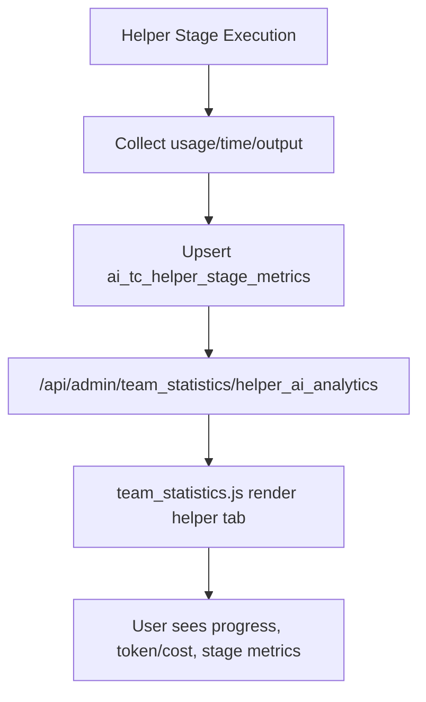

## Context

目前 `team_statistics.html` + `team_statistics.js` 已有多個 tab 與對應 `/api/admin/team_statistics/*` API，但尚未涵蓋 QA AI Agent - Test Case Helper 的流程統計。既有 helper 資料結構以 `ai_tc_helper_sessions` / `ai_tc_helper_drafts` 為核心，缺少可直接彙總的 stage-level token、duration、output_count telemetry，因此無法可靠產生「帳號-單號進度」、「token/cost」、「各階段耗時與產量」分析。

此變更為跨模組改動（helper service、統計 API、team statistics 前端、i18n、資料模型），需先定義統一的 telemetry contract 與 cost estimation 規則。

## Goals / Non-Goals

**Goals:**
- 在團隊數據統計頁新增 `QA AI Agent - Test Case Helper` 獨立 tab。
- 提供三類統計：
  1. user-ticket-progress（每帳號處理 ticket 與當前進度）
  2. token usage + estimated cost（可依 pricing tiers 計算）
  3. stage duration + output count（analysis/pretestcase/testcase/commit）
- 建立可重算、可審核的成本估算資料來源與規則。
- 保持既有 helper 主流程與 UI 不被破壞。

**Non-Goals:**
- 不實作實際計費/扣款流程（只做 estimate）。
- 不引入外部 BI 平台或新前端框架。
- 不改寫 team statistics 既有 tab 的資料模型。

## Decisions

1. **新增 helper stage telemetry 表，而非將統計寫死在 session 表**
- Decision: 新增 `ai_tc_helper_stage_metrics`（建議欄位：`session_id`, `team_id`, `user_id`, `ticket_key`, `phase`, `started_at`, `ended_at`, `duration_ms`, `input_tokens`, `output_tokens`, `cache_read_tokens`, `cache_write_tokens`, `pretestcase_count`, `testcase_count`, `model_name`, `usage_json`）。
- Why: session 主表保持輕量；統計查詢可用 phase 粒度聚合；支援後續擴充多模型與分段計費。
- Alternative: 把聚合值塞回 `ai_tc_helper_sessions` JSON 欄位；否決，因查詢與索引效率差。

2. **成本估算採固定 Google Vertex pricing profile（依需求圖）**
- Decision: 初版直接採用需求指定費率（USD per 1M tokens）：
  - `Input`: `<=200K` = 2, `>200K` = 4
  - `Output`: `<=200K` = 12, `>200K` = 18
  - `Cache Read`: `<=200K` = 0.20, `>200K` = 0.40
  - `Cache Write`: 0.375（固定）
  - `Input Audio`: `<=200K` = 2, `>200K` = 4
  - `Input Audio Cache`: `<=200K` = 0.20, `>200K` = 0.40
- Decision: 每個 token 分類獨立判斷 tier（threshold = 200,000 tokens），並以 `cost = tokens / 1_000_000 * rate` 計算後彙總。
- Why: 使用者已指定費率來源與分段規則，先落實確定口徑以降低解讀歧異。
- Alternative: 動態外部 pricing config；延後到後續 change，再做多版本價格治理。

3. **Team Statistics 新增單一聚合端點，前端一次載入**
- Decision: 新增 `/api/admin/team_statistics/helper_ai_analytics`（支援 days/date range + team filter + optional user/ticket filter）。
- Why: 與現有統計頁架構一致，減少多次 round-trip 與畫面閃爍。
- Alternative: 多個細粒度端點；否決，會增加前端協調與權限重覆檢查成本。

4. **前端維持既有 tab/table/card 風格，新增 helper 專屬區塊**
- Decision: 在 `team_statistics.html` 增加 tab 與 pane；`team_statistics.js` 加入載入與渲染函式（progress table、token/cost summary、phase metrics table/chart）。
- Why: 延續既有 style system 與 permission guard，降低回歸風險。

5. **Telemetry 寫入時機：helper stage 完成或失敗時 upsert**
- Decision: 在 helper service 的 analyze/generate/commit 等 stage 收斂點寫入 telemetry，失敗也記錄 duration 與錯誤狀態。
- Why: 保證統計完整（含 failed/cancelled），可做瓶頸分析。

### Flow Diagram

## Risks / Trade-offs

- [Risk] 舊 session 無 telemetry 歷史資料 → Mitigation: API 回傳 `data_coverage` 與「資料不足」提示，不阻斷頁面。
- [Risk] 成本估算規則與實際帳單存在差異 → Mitigation: UI 明確標示 estimate，並顯示固定 pricing profile（Google Vertex baseline）與計算時間。
- [Risk] 大量資料聚合造成慢查詢 → Mitigation: 新增索引（team_id, phase, started_at），必要時用 materialized summary。
- [Risk] 多團隊過濾邏輯回歸 → Mitigation: 重用現有 team filter 參數處理與 admin permission。

## Migration Plan

1. 新增 DB 欄位/表與安全遷移（保持 backward compatible）。
2. 在 helper service 寫入 telemetry（先寫入，不先開 UI）。
3. 新增統計 API 與 unit tests（aggregation + cost estimation）。
4. 新增 team statistics tab 與前端渲染/i18n。
5. 灰度驗證：對比 sample session 手算成本與 API 結果。
6. Rollback: 關閉 helper tab 與 API 掛載；保留 telemetry 表不影響既有流程。

## Open Questions

- 是否要提供「按模型」與「按階段」雙軸成本拆解（初版可先單軸）？
- 是否需要匯出 CSV（若需要可在後續 change 擴充）？
