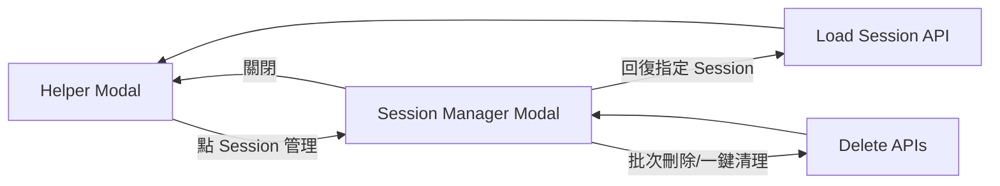

## Context

現況的 AI Agent - Test Case Helper 只提供 `restore last session`，前端透過 localStorage 記住最近 session id，再呼叫 `GET /sessions/{session_id}` 回復。缺少「可瀏覽全部 sessions、指定回復、批次刪除、清理」能力，導致多張 JIRA ticket 並行時操作成本高、風險高。

本次變更同時涵蓋前後端：
- Backend: 新增 session list/delete/bulk-delete/clear API（沿用現有 team write permission 與 audit logging）
- Frontend: 新增 Session Manager modal（左右欄）與 helper modal 切換 orchestration
- Contract: session display naming 改為 timestamp-based label（不再以流水號對外顯示）

## Goals / Non-Goals

**Goals:**

- 提供可視化 session 管理：瀏覽、回復、批次刪除、一鍵清理。
- Session 清單左側可辨識 JIRA ticket（`ticket_key`）與 timestamp 名稱。
- 保證 modal 互斥切換：Session Manager 關閉後，Helper 必定回復顯示。
- 回復 session 後直接接續原階段與草稿內容。

**Non-Goals:**

- 不改動 helper 三階段核心生成邏輯（normalize/analyze/generate/commit）。
- 不新增複雜 session 標籤編輯或資料夾分類。
- 不引入新的前端 framework 或 global state library。

## Decisions

1. **Session 管理 API 採擴充既有 router**
- Decision: 在 `app/api/test_case_helper.py` 增加：
  - `GET /teams/{team_id}/test-case-helper/sessions`
  - `DELETE /teams/{team_id}/test-case-helper/sessions/{session_id}`
  - `POST /teams/{team_id}/test-case-helper/sessions/bulk-delete`
  - `POST /teams/{team_id}/test-case-helper/sessions/clear`
- Why: 可重用 `_verify_team_write_access`、audit、service boundary，避免新 router 分裂。
- Alternative: 建新 router `test_case_helper_sessions.py`；被否決（重複權限與錯誤映射成本高）。

2. **Timestamp naming 為「衍生欄位」而非 DB 新欄位**
- Decision: 以 `created_at`（或 `updated_at`）在 service response 產出 `session_label`，格式如 `2026-02-26 14:23:10`（本地格式由前端 i18n/date formatter 顯示）。
- Why: 避免 schema migration，保持舊資料可立即套用新命名策略。
- Alternative: 在 `ai_tc_helper_sessions` 新增 `display_name` 欄位；被否決（遷移與回填成本高）。

3. **Session Manager modal 與 Helper modal 以狀態機切換**
- Decision: 在 `ai-helper.js` 新增 modal lifecycle controller（open-manager / close-manager / resume-session），確保同時間只顯示一個 modal。
- Why: Bootstrap nested modal 易造成 backdrop 與 focus trap 問題，顯式切換較穩定。
- Alternative: 疊兩層 modal；被否決（UX 與 z-index 風險）。

4. **左右欄 UI 配置**
- Decision: Session Manager 採與 Helper 一致的 split layout：
  - 左欄：session list（ticket key、timestamp label、phase/status）+ 批次勾選
  - 右欄：session detail + 操作按鈕（回復、刪除、批次刪除、一鍵清理）
- Why: 保持 TCRT helper 操作語意一致，降低學習成本。

5. **刪除語意與安全性**
- Decision: 批次刪除與一鍵清理都需 confirm；刪除後若當前 active session 被刪除，前端清除 localStorage 對應 key。
- Why: 避免回復已刪 session 的錯誤循環。

## Risks / Trade-offs

- [Risk] 大量 session 列表載入慢 → Mitigation: API 預設 `limit` + `updated_at desc`，保留分頁參數。
- [Risk] Modal 切換 race condition（快速點擊） → Mitigation: 切換期間設 busy lock，操作按鈕 disable。
- [Risk] 批次刪除誤操作 → Mitigation: 顯示刪除數量與 ticket 摘要確認文案。
- [Risk] timestamp 顯示時區混淆 → Mitigation: 前端統一使用使用者 locale/timezone 呈現，API 回傳 ISO-8601 UTC。

## Migration Plan

1. 先部署 backend API + service/model response 擴充（向後相容，不破壞舊 endpoint）。
2. 前端導入 Session Manager modal 與按鈕入口，掛接新 API。
3. 加入 i18n keys（`zh-TW`/`zh-CN`/`en-US`）與前端/後端測試。
4. 驗證：
   - open/close manager modal
   - resume arbitrary session
   - bulk delete + clear all
   - localStorage fallback 正常
5. Rollback: 若 UI 發生問題可回退前端資產；backend 新增 endpoint 不影響既有 helper 主流程。

## Open Questions

- 一鍵清理是否需限制為「僅刪除 completed/failed」，還是允許刪除 active？
- Session list 是否需要 server-side 分頁 UI（目前先採 limit + load more）？
- 是否需要保留最少一筆最近 session（防止全部清空）？
