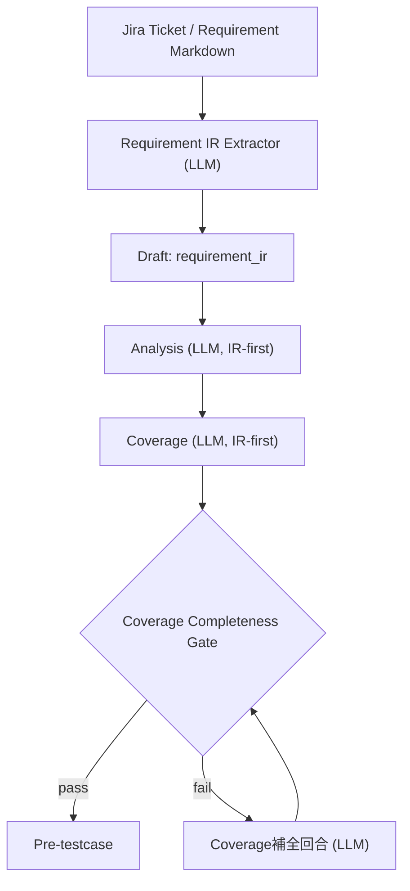

## Context

目前 helper 流程在 `requirement -> analysis` 直接使用 Jira 長文本，對於雙語內容與複雜表格（例如 `TCG-93178` Reference）容易造成後續 coverage 解析失敗或語意遺漏。現況雖有 JSON repair，但 repair 只保證語法可解析，不保證需求覆蓋完整。

本次設計採 IR-first（Intermediate Representation）模式：先將 requirement 轉為 machine-readable JSON，再驅動 analysis/coverage，以提升穩定性與可驗證性。

## Goals / Non-Goals

**Goals:**
- 在不改變既有使用者操作路徑下，新增 `requirement_ir` 隱藏階段。
- 使 analysis/coverage 的輸入結構化，降低表格需求遺漏率。
- 以程式化 gate 驗證 coverage 是否覆蓋所有 analysis item/section。
- 強化失敗回復策略，避免「修語法成功但語意缺漏」。

**Non-Goals:**
- 不新增前端可見 step（IR 不給使用者編輯）。
- 不改變最終 testcase model 與 commit 寫入流程。
- 不導入背景 job 或非同步佇列。

## Decisions

### Decision 1: 新增 `requirement_ir` draft phase（隱藏）
- Choice: 在 session drafts 增加 `requirement_ir` payload，儲存標準化 JSON（scenario/rule/reference_columns/edits）。
- Why: 保留 machine contract，讓後續階段可重用與重試。
- Alternatives:
  - 僅在記憶體中傳遞 IR：重試與稽核可追溯性不足。

### Decision 2: Analysis 改為 IR-first prompt
- Choice: analysis prompt 改吃 `requirement_ir_json` + ticket metadata，不直接吃原始 Jira 長文。
- Why: 減少 prompt 噪音，讓 analysis item id 與 section 更穩定。
- Alternatives:
  - 保持現狀直接吃全文：高 token 波動且表格語意容易流失。

### Decision 3: Coverage 增加完整性契約 + Gate
- Choice:
  - coverage prompt 強制：每個 analysis item id 必須至少被一筆 seed.ref 覆蓋。
  - 輸出附 `trace`（analysis_item_count/covered_item_count/missing_ids/missing_sections）。
  - 伺服器端二次驗證，未通過則觸發補全回合。
- Why: 從「模型自律」提升為「模型 + 系統雙重保證」。
- Alternatives:
  - 只靠 prompt 約束：在複雜 ticket 下仍不穩定。

### Decision 4: Coverage 失敗時採「重生優先、repair 次之」
- Choice: parse fail 時先重跑一次完整 coverage；仍失敗才進 JSON repair。
- Why: repair 主要修語法，不足以恢復被漏掉的語意內容。
- Alternatives:
  - 直接 repair：低成本但覆蓋風險高。

### Decision 5: 表格需求 IR 正規化
- Choice: 將表格列轉為 `reference_columns[]` 結構欄位，顯式保留 `sortable/fixed_lr/format_rules/cross_page_param/edit_note`。
- Why: 讓表格需求可被 analysis/coverage 逐條引用，避免「整段表格被摘要掉」。
- Alternatives:
  - 保留 markdown table 原樣：對 LLM 解析穩定度較差。

### Decision 6: 使用者互動維持不變
- Choice: UI 仍為既有三步 modal；IR 僅後端內部新增。
- Why: 降低改動風險與使用者學習成本。
- Alternatives:
  - 暴露 IR 編輯器：增加複雜度且不符合本次需求。

## User Interaction + Technical Implementation

- User interaction:
  - 使用者仍在 Step1 輸入 TCG 並觸發 analysis/coverage。
  - 使用者不會看到 `requirement_ir`，但會在 Step2 看到更完整的 pre-testcase。

- Technical implementation:
  - `app/services/jira_testcase_helper_service.py`
    - 新增 `build_requirement_ir()`
    - 在 `analyze_and_build_pretestcase()` 內先產生/更新 `requirement_ir` draft
    - analysis/coverage 改用 IR prompt
    - 新增 `validate_coverage_completeness()` 與補全回合
  - `app/services/jira_testcase_helper_prompt_service.py`
    - 新增 IR extractor prompt template 與 coverage 補全 prompt template
  - `app/config.py` + `config.yaml`
    - 新增 prompt keys（`requirement_ir`, `coverage_backfill`）
  - `app/models/test_case_helper.py`
    - 新增對應 phase 常數（若需）與 payload typing（相容性優先）

## Risks / Trade-offs

- [IR schema 過度僵化] → 先用必要欄位，允許 `ext` 擴展欄位。
- [多一個 LLM 回合增加延遲] → 只在 `analysis` 入口執行一次；補全回合僅 gate fail 時觸發。
- [補全 merge 失誤造成重複 seed] → 以 `(g,t,ref,cat,st)` 去重並保持原排序。
- [配置增長導致維運成本] → 全部收斂於 `config.yaml`，不拆新設定檔。

## Migration Plan

1. 新增 prompt 設定鍵與 typed config（相容預設）。
2. 新增 `requirement_ir` draft 寫入與讀取流程。
3. 改寫 analysis/coverage prompt 參數來源為 IR-first。
4. 新增 coverage completeness gate + backfill 回合。
5. 新增測試：
   - IR 產生（含表格欄位）
   - coverage completeness gate
   - parse fail 重試策略
6. 以 feature flag（或 config 開關）逐步啟用，觀察 coverage 遺漏率。

Rollback:
- 關閉 IR-first 開關，回退到現有 direct requirement 流程。
- 保留 `requirement_ir` draft 不影響既有資料結構。

## Open Questions

- `requirement_ir` 是否要納入 API response（僅 debug 模式）？
- coverage backfill 回合最大次數建議為 1 還是 2？
- 是否需要將 `trace` 結果顯示在 UI（先隱藏、僅 log）？
