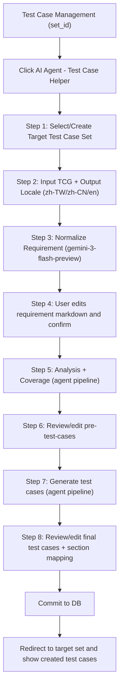

## Context

目前系統已有：
- `app/templates/test_case_management.html` 與 `app/static/js/test-case-management/*` 的 Test Case 管理頁。
- 可重用的 Markdown 編輯與預覽能力（`markdown.js` + 現有 modal UI）。
- Test Case / Set / Section 的既有 API 與資料模型（`test_cases.py`, `test_case_sets.py`, `test_case_sections.py`）。
- JIRA 讀取能力（`app/api/jira.py`, `app/services/jira_client.py`）。

本次需求是把「JIRA Ticket → Test Case」由 PoC 流程產品化，整合進 Test Case Set 管理畫面，並提供多輪人工確認與編輯，最終落地到既有 Test Case model（含 section）。

## Goals / Non-Goals

**Goals:**
- 在現有 Test Case 管理頁提供完整 AI helper 精靈流程，不離開頁面即可完成建立。
- 支援需求/分析/預產出/最終產出四個可編輯 checkpoint，均可 Markdown 編輯。
- 支援輸出語系選擇（繁中、簡中、英文）並以 UI 語言預設。
- 產出內容可映射到現有 `TestCaseCreate` / `TestCaseLocal` 與 `TestCaseSection` 邏輯。
- 建立完成後導回目標 set 並可立即看到新建資料。

**Non-Goals:**
- 不改動既有 Test Case 核心欄位定義（不做破壞性 schema 變更）。
- 不在本次引入新前端框架或 Node build 流程。
- 不處理跨產品同步（例如自動回寫 Jira comment）作為首版範圍。

## Decisions

### Decision 1: UI 以「頁內 wizard modal」實作，不新增獨立頁
- Choice: 在 `test_case_management.html` 新增 `AI Agent - Test Case Helper` 按鈕與 wizard modal。
- Why: 符合現有資訊架構與使用者心智，且能直接重用 markdown editor / i18n / team context。
- Alternatives:
  - 新增獨立頁面：可視覺自由度高，但切換成本高、狀態傳遞複雜。
  - 側欄式流程：對小步驟可行，但多階段確認與預覽空間不足。

### Decision 2: 後端採「Session State Machine + 可持久草稿」模型
- Choice: 新增 helper session（建議新表 `ai_tc_helper_sessions` + `ai_tc_helper_drafts`）保存每階段內容與狀態。
- Why: AI 流程長、可重試且需保留使用者修改，僅靠前端暫存風險高。
- Alternatives:
  - 純前端 localStorage：實作快，但跨裝置/刷新與稽核能力不足。
  - 單一同步 API 一次完成：不符合人機共編與多次確認需求。

### Decision 3: API 拆成「階段動作」而非單一巨型端點
- Choice: 提供 `start / normalize / analyze / generate / commit` 分段 API。
- Why: 可明確權限與錯誤回復，前端可精準顯示 loading/error，測試可分層驗證。
- Alternatives:
  - 單一 `run_all`：失敗定位困難、UI 無法插入人工編輯 checkpoint。

### Decision 4: Test Case 與 Section 建立採「嚴格映射 + 自動補齊 section」
- Choice:
  - 生成結果先落成嚴格 JSON（欄位對應 `test_case_number/title/precondition/steps/expected_result/priority/tcg/test_case_set_id/test_case_section_id|section_path`）。
  - `section_path` 若不存在，透過 `TestCaseSectionService` 逐層建立（<=5 層）；失敗回退至 `Unassigned`。
- Why: 保證資料可寫入既有 model，避免產生無效 section 關聯。
- Alternatives:
  - 僅輸出純文字讓使用者手貼：無法保證資料一致性，使用成本高。

### Decision 5: LLM 管線分三階段，模型責任分離
- Choice:
  - Requirement normalization: `gemini-3-flash-preview`（多語需求辨識、統整、格式化，輸出目標語系）。
  - Analysis: `gemini-3-flash-preview`。
  - Coverage: `gpt-5.2`。
  - Test case generation: `gemini-3-flash-preview`。
  - Audit: `gemini-3-flash-preview`。
  - 各階段模型可在 `config.yaml` 覆寫（但預設值如上）。
- Why: 將「整理需求」與「生成測項」解耦，提升可控性與可調試性。
- Alternatives:
  - 單次 prompt 一次完成：品質波動較大，難以插入人工覆核。

### Decision 5-2: 模型路由統一走 OpenRouter
- Choice:
  - helper 各階段呼叫統一使用 OpenRouter Chat Completions。
  - `config.yaml` 只儲存各階段 `model` 字串，不拆多家 provider client。
- Why: 簡化金鑰與連線管理，降低環境差異與維運複雜度。
- Alternatives:
  - 直接串 Gemini/OpenAI 原生 SDK：可利用供應商特性，但設定與錯誤處理分岔。

### Decision 5-1: 設定來源統一為 config.yaml（禁止獨立 LLM 設定檔）
- Choice:
  - 本功能模型設定統一放在 `config.yaml`（例如 `ai.jira_testcase_helper.models.analysis/coverage/testcase/audit`）。
  - 設定由 `app/config.py` 載入並注入 helper service。
  - 本功能不得依賴獨立設定檔（例如 `ai/llm_config.yaml`）作為 runtime 設定來源。
- Why: 避免設定分散、環境不一致與維運混淆，符合專案單一設定來源習慣。
- Alternatives:
  - 保留獨立 llm config：短期彈性高，但長期維運成本高且易出錯。

### Decision 5-3: 語言策略分離（UI review vs output generation）
- Choice:
  - Requirement normalization 的最終呈現語言以 UI locale 為準（供使用者審閱與編輯）。
  - Test case generation 的產出語言以使用者明確選擇的 output locale 為準。
- Why: 同時滿足「閱讀便利」與「輸出目的語言」兩種需求，不互相覆蓋。
- Alternatives:
  - 全流程只用單一語言：實作較簡單，但不符合目前使用情境。

### Decision 5-4: 四階段 prompt 模板沿用 PoC 並收斂到 config.yaml
- Choice:
  - Analysis/Coverage/Testcase/Audit 四階段 prompt 模板預設值參考 `/Users/hideman/code/test_case_agent_poc/llm_config.yaml`。
  - 模板集中放在 `config.yaml`（`ai.jira_testcase_helper.prompts.*`），由 `app/config.py` typed config 載入。
  - 系統提供模板變數替換（例如 `ticket_key`、`coverage_questions_json`、`testcase_json`）供各階段共用。
- Why: 確保 prompt 行為與已驗證 PoC 一致，同時符合「設定統一由 config.yaml 管理」原則。
- Alternatives:
  - 將 prompt 硬編碼在程式：初期快，但後續調整成本高且不利 A/B 驗證。

### Decision 7: Test Case ID 10-step allocator
- Choice:
  - ID 格式採 `[TCG].[middle].[tail]`。
  - middle 與 tail 均使用 10 遞增（010, 020, 030...）。
  - 支援 initial middle number（預設 010），依 AC/條目分組遞增。
- Why: 與現有命名慣例一致，便於人工閱讀與後續維運。
- Alternatives:
  - 連號遞增（001,002...）：較密但可讀性與分組語意較弱。

### Decision 8: Commit 採同步請求 + 單交易原子提交
- Choice:
  - 維持同步請求（不引入背景 job）。
  - 所有 LLM 階段在交易外執行；commit 階段才開 DB 寫入交易。
  - commit 內 section 建立與 test case 建立同一交易，任一失敗全部 rollback。
- Why: 符合目前系統同步 API 與 `run_sync + commit/rollback` 實作模式，且可保障資料一致性。
- Alternatives:
  - 背景 job：可提升 UI 響應，但超出本次需求且增加工作佇列複雜度。

### Decision 9: 整合層採「既有重用 + Qdrant 專用 client」
- Choice:
  - Jira 連線必須重用 `app/services/jira_client.py`。
  - OpenRouter 設定/金鑰必須重用 `app/config.py` 的 `settings.openrouter` 管線（runtime 呼叫沿用現有 API 呼叫模式）。
  - Qdrant 必須建立獨立 `app/services/qdrant_client.py`（async、單例、可關閉），並沿用既有 `ai/jira_to_test_case_poc.py`、`ai/llm_config.py`、`ai/etl_all_teams.py` 的查詢策略與設定結構。
- Why: Jira/OpenRouter 已有成熟整合可直接重用；Qdrant 目前散落於腳本層，需收斂為正式服務層 client 才能滿足多人連線與長連線穩定性。
- Alternatives:
  - 持續在各功能內各自 new `QdrantClient`：維護成本高，連線管理與效能隔離不可控。

### Decision 10: Qdrant client 需具備並發隔離與生命週期管理
- Choice:
  - 使用 `AsyncQdrantClient` + 全域單例 service（`get_qdrant_client()`）。
  - 以 `config.yaml` 管理 timeout/pool/concurrency/retry 參數，並於 `startup/shutdown` 建立與釋放 client。
  - 以 semaphore 控制同進程內並發請求上限，避免單一長任務壓垮其他使用者請求。
- Why: 兼顧現有同步流程與多人使用時的穩定性，不引入額外背景系統即可改善資源競爭。
- Alternatives:
  - 每次請求建立短生命週期 client：TLS/連線成本高，長流程下更容易造成資源抖動。

### Decision 6: 視覺與互動遵循現有系統風格，並套用 frontend design 原則
- Choice: 使用現有 Bootstrap/元件語彙，新增清晰 stepper、狀態 badge、差異預覽區，不破壞既有頁面語言。
- Why: 降低學習成本，同時滿足「可明確確認與編輯」需求。
- Alternatives:
  - 完全重繪介面：風險高，導入成本大。

## Risks / Trade-offs

- [External LLM latency/timeout] → 每階段獨立 timeout、retry、可重送且保留已編輯內容。
- [Generated content 不符合 DB 模型] → 在 commit 前做 schema validation 與欄位正規化，失敗阻擋入庫。
- [Section 自動建立造成結構膨脹] → 提供使用者最終編輯與 section 重映射；預設可改為既有 section。
- [語系混雜導致詞彙不一致] → requirement normalization 以 UI locale 呈現、testcase generation 以 output locale 產出，並在各階段顯示語系標記。
- [權限/稽核缺口] → 全流程沿用 team 權限檢查，關鍵操作寫入 audit log（start/commit）。
- [同步長流程影響他人使用體感] → 將 DB 交易縮到最後 commit、限制單次 commit 筆數並監控 API latency/p95。
- [Qdrant 長連線擠壓其他請求] → 服務層統一連線池/並發上限/重試退避，並在 shutdown 明確 close。

## Migration Plan

1. 新增後端 session/draft 模型與 API（先以 feature flag 隱藏入口）。
2. 在 `database_init.py` 加入相容性檢查與安全建立（僅新增，不破壞既有資料）。
3. 新增前端 wizard 模組與 i18n 字串（`zh-TW/zh-CN/en-US`）。
4. 在 `config.yaml` / `config.yaml.example` 增加 helper 分階段模型與 qdrant client 設定，並於 `app/config.py` 提供 typed config。
5. 實作 ID allocator（10-step）與 commit 原子交易流程（含 rollback）。
6. 建立 `app/services/qdrant_client.py` 並接入 app startup/shutdown 生命週期，提供 async 安全呼叫介面。
7. 串接 AI provider（OpenRouter: Gemini + GPT-5.2）與既有 agent pipeline，完成 schema validator。
8. 開啟 feature flag 給測試團隊；驗證後全面啟用。

Rollback:
- 關閉 feature flag 立即停用入口。
- 保留新增資料表不影響既有流程（無需回滾 schema）。

## Open Questions

- 單次產出 test case 數量上限與 token cost guardrail 要設多少？
- 是否需要在 UI 提供「匯出 markdown 檔」作為審核留存（首版可選）？
