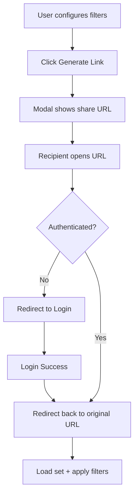

## Context

目前 Test Case Set 案例管理頁已有篩選能力與 `套用篩選` 按鍵，但缺少可分享同一篩選狀態的深連結（deep link）。  
需求重點是：在不破壞既有權限模型下，讓使用者可產生並分享目前篩選狀態；接收者開啟後可直接看到相同結果。若接收者未登入，必須先完成登入再回到同一連結。

## Goals / Non-Goals

**Goals:**
- 在 Test Case Set 案例管理頁新增 `產生連結` 按鍵與連結顯示 modal。
- 連結可完整還原目前 set 與篩選條件。
- 未登入訪問共享連結時，登入後可準確回跳並顯示同一篩選結果。
- 保持既有 RBAC/權限檢查與頁面互動一致。

**Non-Goals:**
- 不新增短網址服務或一次性 token 機制。
- 不變更既有篩選語意與查詢結果排序規則。
- 不新增跨頁分享管理（例如分享歷史、撤銷分享）。

## Decisions

### Decision 1: 以 URL query string 作為唯一狀態載體
- 決策：共享連結使用既有頁面 URL + query params（含 set id 與 filter 欄位）。
- 理由：可直接被瀏覽器、書籤與登入回跳流程處理，實作風險低，與現有前端初始化流程相容。
- 替代方案：將篩選狀態存 DB 後分享 token。  
  未採用原因：需要額外資料模型與清理策略，對目前需求過重。

### Decision 2: 前端顯示 modal 並提供複製入口
- 決策：點擊 `產生連結` 後即時計算 URL，於 modal 顯示 readonly 欄位與 copy action。
- 理由：符合現有 Bootstrap/原生 JS 模式，操作可預期且低侵入。
- 替代方案：直接複製到剪貼簿不顯示 UI。  
  未採用原因：可見性差，失敗時回饋不足。

### Decision 3: 登入前保存完整目標 URL，登入後原樣回跳
- 決策：沿用既有 auth redirect 機制，確保 query string 不遺失。
- 理由：滿足「未登入先登入再進入相同篩選畫面」的核心需求，並避免重新組裝參數造成偏差。
- 替代方案：登入後僅回到 set 首頁再由 local state 還原。  
  未採用原因：跨流程不穩定，且無法保證可分享性。

## Risks / Trade-offs

- [Risk] query 參數編碼不一致導致還原失敗 → Mitigation: 統一序列化與 decode 規則，加入 URL round-trip 測試。  
- [Risk] 分享連結包含過多參數造成可讀性差 → Mitigation: 僅保留必要 filter 欄位，忽略預設值。  
- [Risk] 登入流程遺失 return URL → Mitigation: 補整合測試覆蓋未登入開啟共享連結路徑。  
- [Trade-off] 使用明文 query 便於除錯但非隱藏式分享 → 維持現狀，避免引入高複雜度 token 流程。

## Migration Plan

1. 前端新增按鍵、modal 與 URL 產生/套用邏輯。  
2. 驗證現有登入回跳機制可保留完整 query；必要時補修正。  
3. 新增測試（已登入直接開啟、未登入登入後回跳、參數 round-trip）。  
4. 上線採非破壞部署，若異常可快速回滾前端資產與對應路由調整。

Rollback strategy:
- 回退 JS/模板變更即可停用「產生連結」功能；既有篩選流程不受影響。

## Open Questions

- 是否需要限制可分享的篩選欄位清單（例如排除暫存 UI-only 欄位）？  
- modal 是否要提供「開新分頁預覽」作為輔助操作？  
- 是否需要在 i18n 文案中新增更明確的權限不足提示（forbidden set access）？
