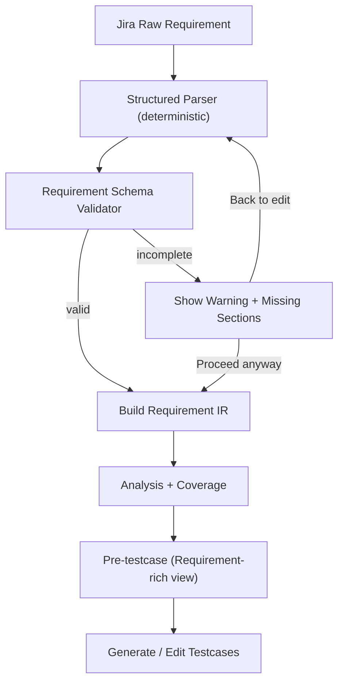

## Context

目前 `AI Agent - Test Case Helper` 已採 IR-first 流程，但 requirement 來源仍偏向自由文字，缺少對 Jira wiki 格式的明確契約與完整性 gate。  
此外，analysis 階段的 pre-testcase 主要呈現 `ref/rid` 等參考代號，對測試設計者而言不足以直接回看「需求內容 + 規格驗證要求」，導致進入 testcase 產生/編修時上下文流失。

本次設計目標是：  
1) 在 analyze 前建立可驗證的 requirement 格式化契約。  
2) 在格式不完整時提供「可前進但需明確警告」機制。  
3) 在 pre-testcase UI 直接呈現需求規格與驗證重點，而不是以參考代號為主。

## Goals / Non-Goals

**Goals:**
- 定義標準 requirement schema（對齊 `Menu / User Story Narrative / Criteria / Technical Specifications / Acceptance Criteria / API 路徑`）。
- 在 analyze 前執行 completeness validation，缺漏時彈警告並允許使用者 override 前進。
- 調整 pre-testcase 條目呈現，直接顯示需求內容、規格條件、檢核與預期，降低對 `ref token` 的依賴。
- 保持既有三步驟 helper UX 與後端 draft 相容。
- 最大化保留現有 Test Case Helper UI 建設成果，僅做必要最小改動。

**Non-Goals:**
- 不新增獨立頁面或第四個 wizard step。
- 不做破壞性 DB schema migration。
- 不在本次導入新的外部 parser library（先用既有 Python parsing + regex/token 規則）。

## Decisions

### Decision 1: Requirement Schema 採「段落契約 + 子欄位契約」
- Choice:
  - 建立 `structured_requirement` payload，核心欄位：
    - `menu_paths[]`
    - `user_story.{as_a,i_want,so_that}`
    - `criteria.items[]`
    - `technical_specs.items[]`
    - `acceptance.scenarios[]`（每項含 `given[]/when[]/then[]/and[]`）
    - `api_paths[]`, `references[]`
  - 支援 Jira wiki 標記（`h1/h2/h3`, `*`, `[text|url]`）。
- Why: 讓 downstream IR/analysis 能依固定語意鍵拆解，避免自由文字導致的波動。
- Alternatives:
  - 全量依賴 LLM 萃取 schema：彈性高，但 deterministic 與可重現性差。

### Decision 2: Completeness Validation 採「阻斷前警告 + 使用者可覆寫」
- Choice:
  - analyze 前先跑 validator，產出 `missing_sections[]`, `missing_fields[]`, `quality_level`。
  - 若不完整，前端顯示 warning dialog（列出缺漏項）並提供：
    - `返回修正`
    - `仍要繼續`
  - 使用者選擇繼續時，後端記錄 `override=true` 與缺漏快照，流程可前進。
- Why: 兼顧品質控管與實務彈性（有些票仍需先跑流程）。
- Alternatives:
  - 強制阻擋：品質高但阻礙操作。
  - 完全不擋：品質風險過高。

### Decision 3: Pre-testcase 呈現改為 Requirement-rich Entry
- Choice:
  - 每個 pre entry 新增可視化資料塊（payload 層）：
    - `requirement_context.summary`
    - `requirement_context.spec_requirements[]`
    - `requirement_context.verification_points[]`
    - `requirement_context.expected_outcomes[]`
  - UI 預設顯示上述內容；`ref/rid` 降級為 trace metadata，不作主要欄位。
- Why: 讓測試設計者在 pre-testcase 即可直接讀到「要驗什麼、驗收標準是什麼」。
- Alternatives:
  - 保留現況僅代號映射：需要頻繁跳回 analysis/IR 才能理解需求。

### Decision 4: Analysis/Coverage 到 Pre-testcase 的映射規則固定化
- Choice:
  - Scenario 為主要映射單位；`Given/When/Then` 轉成可執行驗證提示。
  - `Criteria/Technical Specs` 直接展開為 `spec_requirements` 與 `verification_points`。
  - 平台差異（Web/H5）拆成獨立 pre entries。
- Why: 對齊你提供的需求範例，確保規格內容不在中途被壓縮掉。
- Alternatives:
  - 混合壓縮呈現：字數短，但可追溯性下降。

### Decision 5: 相容性策略（Backward Compatible Contract）
- Choice:
  - 保留現有 `pretestcase.en[].ref/rid/chk/exp` 以確保生成器相容。
  - 新增欄位採 optional，前端優先讀 `requirement_context.*`，舊資料則 fallback 現有欄位。
- Why: 降低 rollout 風險，避免一次性改壞既有 session。
- Alternatives:
  - 一次改斷舊格式：維護簡單，但風險高。

### Decision 6: Requirement Trace Key 穩定化
- Choice:
  - 為每個需求單位建立穩定 `requirement_key`（如 `REQ-*` / `SPEC-*`），並在 `structured_requirement -> requirement_ir -> pretestcase -> testcase` 全鏈路保留。
  - `ref/rid` 保留為 trace metadata，但主顯示改以 requirement context 與 verification points。
- Why: 避免排序、重編號或回補時造成需求對應遺失。
- Alternatives:
  - 只用 analysis item id：在補全/重算流程中較容易漂移。

### Decision 7: Prompt 與契約單一來源
- Choice:
  - 將 helper prompt 與 schema contract 的權威來源收斂到 `config`（含版本欄位），service 僅負責 render 與 validate。
  - 禁止在多處硬編碼相同契約片段（避免 drift）。
- Why: 降低維護成本與跨模組規則不一致。
- Alternatives:
  - 維持多來源：短期改動快，但長期容易失配。

### Decision 7.1: Analysis/Coverage 生成合併為單次呼叫
- Choice:
  - analyze 階段僅呼叫一次 `analysis` prompt，要求同時回傳 `analysis` 與 `coverage`。
  - 移除獨立 coverage 初次生成呼叫路徑，避免同一階段雙呼叫。
  - 若合併輸出缺少 coverage、coverage 不完整或四面向不齊，直接視為 analysis 失敗並報錯。
  - 僅保留 LLM 呼叫層補救：同次呼叫的重試與 JSON repair，不新增額外 coverage 補流程。
- Why: 降低 latency、成本與雙 prompt 契約漂移風險，並消除「分析階段仍顯示兩步驟」與 fallback 分支過多的問題。
- Alternatives:
  - 保留 coverage second call 或 deterministic backfill：可補救部分輸出失敗，但造成流程複雜、觀測混淆與責任邊界不清。

### Decision 8: Service 拆模組，保留 Orchestrator
- Choice:
  - 將大型 helper service 分為：
    - `requirement_parser`
    - `requirement_validator`
    - `requirement_ir_builder`
    - `analysis_coverage_orchestrator`
    - `pretestcase_presenter`
  - 保留單一 orchestrator 組裝流程與 phase transition。
- Why: 降低單檔複雜度，提升可測試性與定位效率。
- Alternatives:
  - 維持單體 service：開發快，但認知負擔與回歸風險高。

### Decision 9: Draft Payload Envelope 統一
- Choice:
  - 各 phase payload 採統一外殼：
    - `schema_version`
    - `phase`
    - `data`
    - `quality`
    - `trace`
  - 既有 payload 結構以 adapter 相容讀取。
- Why: 讓前後端與測試都能用一致模式讀寫，降低 if/else 分支。
- Alternatives:
  - 每 phase 自由格式：彈性高但維護成本高。

### Decision 10: UI 簡化優先重用既有元件
- Choice:
  - requirement 不完整警告流程直接重用既有 confirm modal / notify，不新增第二套對話框。
  - pretestcase category 僅保留 `happy/negative/boundary` 三值，與後端規則一致。
  - UI 改動策略採「reuse-first」：保留既有三步驟 modal、佈局、元件語彙，只在新流程缺口處補強。
  - 若需新增或調整 UI 呈現，實作階段必須使用 TCRT UI 風格建構流程（以 `$tcrt-ui-style` skill 為標準做法）。
- Why: 減少 UI 邏輯分岔與前後端 enum 不一致風險。
- Alternatives:
  - 新增專用 dialog 與額外 category：可客製化但會增加複雜度。

## User Interaction + Technical Implementation

- User interaction:
  - 使用者在 Step 1 觸發 analyze 前，系統先做 requirement completeness 檢查。
  - 若不完整，顯示缺漏清單與確認對話框（返回修正 / 仍要繼續）。
  - Step 2 pre-testcase 主區塊直接顯示需求內容、規格要求、檢核點與預期，不以參考代號作主視圖。

- Technical implementation:
  - 在 analyze 入口新增 validator gate 與 override 決策紀錄。
  - 在 pretestcase payload 增加 `requirement_context`（summary/spec_requirements/verification_points/expected_outcomes）與 `requirement_key`。
  - 以單次 analysis prompt 回傳 `analysis+coverage`，並以 schema/template 約束一次輸出四面向（happy/edge/error/permission）。
  - 若最終輸出缺 coverage、缺欄位或缺面向，analyze 直接失敗回報，不再啟動額外 coverage 生成或 deterministic backfill。
  - 透過 payload adapter 兼容舊 session，並逐步切換到統一 envelope。
  - 以模組化 service 重構 helper 核心流程，orchestrator 僅負責 phase/transaction/telemetry。

## Risks / Trade-offs

- [Parser 規則不足，遇到非典型 wiki 格式會漏抓] → 先提供 `compat mode` 與 `override warning`，並以真實票逐步擴充規則。
- [Pre-testcase 顯示資訊變多，UI 可能過載] → 預設折疊/分區顯示（Summary / Spec / Verification），避免單屏過長。
- [相容舊資料導致前後端判斷複雜] → 明確版本欄位與 fallback 順序，並加入回歸測試。
- [使用者持續 override 可能降低品質] → 納入 telemetry（override ratio、缺漏類型）供後續治理。
- [模組拆分造成短期重構風險] → 先保留 orchestrator，採 façade + adapter 漸進抽離。
- [多來源 prompt 改單一來源時行為變動] → 先以 golden prompt snapshot 驗證，再逐步切換。
- [category 收斂可能影響既有手動編修習慣] → 提供舊值映射到標準三值，並在 UI 顯示轉換說明。
- [UI 新需求導致重做風險] → 先做 UI 重用盤點（component inventory），限制改動在必要範圍並維持 TCRT 視覺語彙一致。

## Migration Plan

1. 建立 `structured_requirement` parser + validator，輸出 `missing_sections/missing_fields/quality_level`。
2. 在 analyze API 增加 warning payload 與 override 決策參數，並寫入 trace。
3. 重用既有 confirm modal 實作「返回修正 / 仍要繼續」互動。
4. 新增 `requirement_key` 與 `requirement_context`，讓 pretestcase 主顯示需求規格與驗證資訊。
5. 統一 payload envelope 與 schema version，提供舊資料 adapter 相容。
6. 逐步拆分 helper service 模組，保留 orchestrator 做流程編排。
7. 對齊 UI/Backend category enum 與 prompt 契約來源，完成 snapshot + 回歸測試。
8. 監控 warning/override 與 trace 完整性，依觀測資料優化規則。
9. 在 UI 變更前完成既有 Helper UI 元件重用清單，並以 TCRT UI 風格準則驗收所有新增視覺變更。

Rollback:
- 關閉 requirement strict-check 開關，回退到舊 analyze 入口。
- 前端改回舊 pre-testcase 呈現（仍保留新增欄位不使用）。
- 使用 adapter 回讀舊 payload，避免因 envelope 切換造成 session 失效。

## Open Questions

- warning dialog 是否需要「本次 session 不再提示」選項？
- `quality_level` 是否分級（error/warn/info）還是先採單一 warn？
- pre-testcase 詳細規格內容是否需要支援一鍵複製到 testcase editor？
- service 拆分應先抽 parser/validator，還是先抽 presenter/orchestrator？
- `requirement_key` 命名規則是否要與既有 `REQ-*`/`REF-*` 完全對齊？
