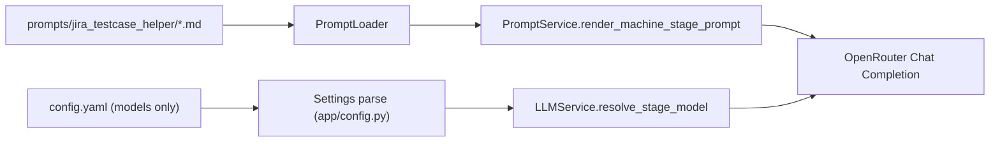

## Context

目前 Test Case Helper 將多階段 prompt 內容直接放在 `config.yaml`，並在 `app/config.py` 建立大型預設字串常數。這讓設定檔同時承擔「模型路由」與「長文本模板」兩種責任，調整 prompt 時易造成 YAML 衝突與審閱困難。  
此外，`analysis` 與 `coverage` 在流程上已合併成單次呼叫，但 models 仍維持雙階段設定；`timeout` 設定目前未實際套用；`system_prompt` 由程式注入但與 stage prompt 重疊。

同時，AI 改寫（editor assist）模型設定目前放在 `openrouter.model`，與 helper 模型分散，增加維護成本與認知負擔。

## Goals / Non-Goals

**Goals:**
- 將 Helper prompt 從 YAML 內嵌文字改為 `prompts/` 目錄下 `.md` 檔案管理。
- 將 AI 改寫模型設定從 `openrouter` 區段移至 `ai` 區段，統一模型治理入口。
- 合併 Helper `analysis/coverage` 模型設定為單一 `analysis`。
- 移除 Helper model 設定中不必要欄位（`timeout`、`system_prompt`），降低配置複雜度。
- 保持既有 API 行為與 helper 三階段 UI 流程不變。

**Non-Goals:**
- 不改動 Helper UI 互動流程與資料庫 schema。
- 不調整 OpenRouter 供應商選擇或 API key 管理方式。
- 不重寫 testcase/audit 生成邏輯，只調整設定來源與契約。

## Decisions

### Decision 1: Prompt 檔案化並建立載入器

- 採用 `prompts/jira_testcase_helper/<stage>.md` 作為單一 prompt 來源。
- `JiraTestCaseHelperPromptService` 新增檔案載入流程（UTF-8），以 stage 名稱映射檔名。
- 若檔案不存在或空內容，回退至程式內 machine template（fail-safe），並記錄 warning。

**Rationale:** 檔案化可讀性高、可獨立 code review，且與模型設定解耦。  
**Alternative considered:** 保留 YAML multiline 並拆分 include；Python YAML 生態與既有載入流程不易導入 include，維護成本較高。

### Decision 2: 模型設定統一到 `ai`，`openrouter` 僅留連線資訊

- 新增/調整 `ai.ai_assist.model`（對應 editor AI 改寫）。
- `openrouter` 僅保留 `api_key`（必要連線憑證）；移除 `openrouter.model` 的業務語義。
- `app/api/test_cases.py` 改讀 `settings.ai.ai_assist.model`。

**Rationale:** 模型路由屬 AI domain，集中到 `ai` 可減少跨區段耦合。  
**Alternative considered:** 保留 `openrouter.model` 並新增 alias；會延長雙來源過渡期且增加歧義。

### Decision 3: Helper stage model 瘦身

- `ai.jira_testcase_helper.models` 僅保留 `analysis`, `testcase`, `audit`。
- 每個 stage config 僅保留真正需要的模型選擇欄位（`model` 與可選 `temperature`）；移除 `timeout`、`system_prompt`、`coverage`。
- OpenRouter chat URL 內聚於 LLM service 常數，不再做 per-stage 設定。

**Rationale:** timeout 未實際生效；system prompt 已由 stage prompt 承擔，移除可避免重複指令。  
**Alternative considered:** 保留 timeout/system_prompt 但標記 deprecated；仍會保留噪音並增加新舊契約並存成本。

### Decision 4: 兼容策略與測試更新

- 先更新 `config.yaml.example` 與 `app/config.py` 預設契約，再更新 prompt/LLM services。
- 測試覆蓋：
  - prompt 檔案讀取與 fallback。
  - `analysis` 單模型路由。
  - `ai.ai_assist.model` 讀取。
  - 舊欄位缺失不應造成啟動失敗。

## Risks / Trade-offs

- [Risk] prompt 檔案缺漏導致執行期錯誤 → Mitigation: 啟動時檢查必要 stage 檔案，並在執行期 fallback + warning。
- [Risk] 移除 `openrouter.model` 造成舊部署設定失效 → Mitigation: 加入暫時性向後相容讀取與明確 deprecation log（一個版本週期）。
- [Risk] 移除 `system_prompt` 影響輸出風格穩定性 → Mitigation: 將關鍵約束完整收斂進 stage prompt 檔，並以既有測試樣本驗證輸出契約。

## Migration Plan

1. 新增 `prompts/` 目錄與 helper 階段 prompt `.md` 檔案。  
2. 調整 `app/config.py` model schema，刪除冗餘欄位並新增 `ai.ai_assist.model`。  
3. 更新 prompt/LLM/API service 的設定讀取路徑。  
4. 更新 `config.yaml.example` 範例。  
5. 補齊與調整測試。  
6. 若上線異常，回滾至上一版設定契約（保留原 `config.yaml` 與程式版號）並恢復舊路徑讀取。

## Open Questions

- 是否需要在啟動階段強制檢查所有 prompt 檔存在（strict mode），或採用 runtime lazy fallback 即可？
- `temperature` 是否也可固定化以進一步簡化模型設定（本次先保留可調整彈性）？
