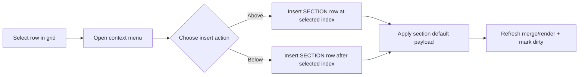

## Context

目前 Ad-hoc execution 的 section 建立僅能透過工具列 `Add Section`，且插入位置固定靠近尾端。右鍵選單已包含 `row_above/row_below/remove_row` 等列操作，但沒有 section 專屬插入行為。目標是在既有 Handsontable context menu 上擴充 `Insert section above/below`，並重用現有 section row 結構。

## Goals / Non-Goals

**Goals:**
- 在右鍵選單新增 `Insert section above` / `Insert section below`。
- 新增 section row 必須與既有 `onAddSection` payload 完全一致。
- 維持 read-only 模式下不可插入 section 的限制。
- 保持既有 section render/merge 與 autosave 流程穩定。

**Non-Goals:**
- 不變更後端 API、資料表或儲存模型。
- 不改寫整個 context menu 架構為新 UI 元件。
- 不新增 section 樣式/欄位客製化功能。

## Decisions

### Decision 1: 採 Handsontable `contextMenu` object items 擴充自訂 action
- **Choice:** 由現行字串陣列改為 object `items`，加入 `insert_section_above`、`insert_section_below`。
- **Rationale:** 能保留既有內建選單，並精準控制插入動作與顯示順序。
- **Alternative:** 自行實作外掛右鍵 menu。缺點是整合成本高且易破壞現有操作。

### Decision 2: 抽出共用 section payload builder
- **Choice:** 將 `onAddSection` 內的 section payload 抽成 helper（例如 `buildSectionRow()`）。
- **Rationale:** 工具列與右鍵插入共享同一資料來源，避免行為漂移。
- **Alternative:** 各自複製 payload 常數。缺點是後續維護容易不一致。

### Decision 3: 以「目前選取列」作為插入基準
- **Choice:** 右鍵 action 依當前 visual row 決定插入 index（上方 = row_above、下方 = row_below）。
- **Rationale:** 符合使用者直覺，並與 Handsontable 既有 row 操作語意一致。
- **Alternative:** 一律插在表尾。缺點是失去本功能核心價值。

### Decision 4: read-only 下移除或停用自訂 section action
- **Choice:** read-only 時 context menu 僅保留可讀操作（如 copy），不提供 section insertion。
- **Rationale:** 與現有 row 新增/刪除限制一致，避免誤導使用者可編輯。
- **Alternative:** 顯示但點擊後報錯。缺點是 UX 較差。

## Risks / Trade-offs

- [Risk] custom item 與既有 menu 順序衝突 → **Mitigation:** 明確放在 row 操作群組附近並保留分隔線。
- [Risk] visual/physical row index 對應錯誤 → **Mitigation:** 以 Handsontable API 取得選取列並在 helper 中統一轉換。
- [Risk] section merge 顯示異常 → **Mitigation:** 插入後沿用既有 `updateSectionMerges` 與 `handleChange` 路徑。

## Migration Plan

1. 調整 context menu 設定並加入 section insertion actions。
2. 抽出共用 section row payload 與插入 helper。
3. 更新 i18n 文案（zh-TW/en-US/zh-CN）。
4. 驗證 editable/read-only 及上/下插入行為。

Rollback strategy:
- 回退 `adhoc_test_run.js` 與 locale keys 變更即可恢復既有行為。

## Open Questions

- 右鍵插入後是否需自動 focus 到 section title 欄位（目前建議保持與現行 Add Section 一致）？
