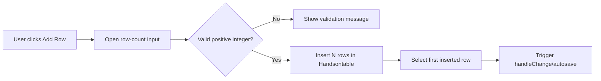

## Context

目前 ad-hoc execution 頁面的 `onAddRow()` 固定一次新增 1 列，對需要快速建立多筆測試資料的使用者而言，必須連續重複點擊同一按鈕，效率偏低。此變更只涉及前端互動層（Jinja2 template + vanilla JS + i18n），不涉及 API 契約或資料庫。

## Goals / Non-Goals

**Goals:**
- 讓使用者可一次輸入要新增的列數（batch add rows）。
- 保持既有 `handleChange`、自動儲存與唯讀阻擋行為一致。
- 補齊 i18n 文案，避免新互動僅有硬編碼英文。

**Non-Goals:**
- 不調整 ad-hoc API、資料模型或儲存格式。
- 不重構整個 toolbar 或導入新前端框架。
- 不在本次引入進階批次模板（例如預填欄位內容）。

## Decisions

### Decision 1: 使用既有 Bootstrap modal 進行列數輸入
- **Choice:** 新增一個小型 modal（數字欄位 + 確認/取消）作為 `Add Row` 入口。
- **Rationale:** 互動一致、可控制驗證提示，且符合現有頁面大量使用 Bootstrap modal 的模式。
- **Alternative:** `window.prompt`。實作較快，但樣式與 i18n 體驗較差。

### Decision 2: 以單次 Handsontable insertion 取代重複呼叫單列新增
- **Choice:** 使用 `hot.alter('insert_row_below', insertAt, count)` 一次插入多列，再逐列套用 `setRowDataFromColumns`。
- **Rationale:** 減少重複事件觸發，行為可預期，與既有資料欄位映射函式相容。
- **Alternative:** 迴圈呼叫現有 `onAddRow` N 次。可重用舊邏輯，但效能與事件副作用較不可控。

### Decision 3: 明確限制輸入範圍並維持 fail-fast
- **Choice:** 僅接受 `1..200` 正整數；取消或非法輸入時不變更表格資料。
- **Rationale:** 避免一次插入過大量列造成 UI 卡頓或誤操作。
- **Alternative:** 無上限。對極端輸入缺乏保護，風險較高。

### Decision 4: 延續唯讀守門與 dirty-state 流程
- **Choice:** `isRunReadOnly` 檢查保留在入口，只有成功插入才呼叫 `handleChange()`。
- **Rationale:** 不破壞 archived run 保護邏輯，也避免錯誤輸入造成誤判未儲存狀態。
- **Alternative:** 先開 modal 再判斷唯讀。會增加不必要互動與狀態分支。

## Risks / Trade-offs

- [Risk] 一次插入大量列造成前端延遲 → **Mitigation:** 加入上限（200）與輸入驗證。
- [Risk] i18n key 分散導致文案不一致 → **Mitigation:** 優先新增在 `adhoc.execution` 結構，必要時保留 fallback。
- [Risk] 批次插入後焦點定位錯誤影響可用性 → **Mitigation:** 固定選取第一個新列並補手動驗證案例。

## Migration Plan

1. 新增 modal 與 i18n 文案（template/locales）。
2. 更新 `onAddRow` 入口流程與批次插入實作（`adhoc_test_run.js`）。
3. 針對合法/非法/取消/唯讀情境進行驗證。
4. 部署不需 DB migration；若需回滾可只還原前端檔案。

Rollback strategy:
- 回退 `adhoc_test_run.js` 與對應 template/locales 變更即可恢復單列新增。

## Open Questions

- 上限值 `200` 是否需改為可設定（例如由 `config.yaml` 控制）？
- 是否要在 modal 中提供「記住上次輸入值」以提升連續操作效率？
