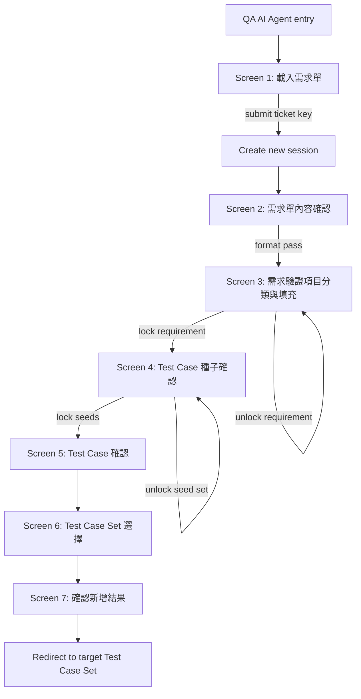

## Context

目前 `rewrite-qa-ai-agent` change 的設計仍建立在以下舊假設上：

1. 使用者會在 intake 期間直接編修 canonical requirement。
2. seed 由 deterministic planner 直接產生。
3. LLM 只負責最後一段 testcase expansion。
4. requirement / plan review 與 requirement delta 會是主要互動面。

這和新版 QA AI Agent 的產品規格不一致。新版規格的核心其實是：

- session 建立要延後到畫面一送出 ticket 後才發生
- 畫面二是唯讀 ticket 確認與格式檢查，不是 requirement editor
- 畫面三是使用者建立「驗證項目 + 檢查條件」的工作台
- 畫面四用 high-tier LLM 產 seed，且支援 diff-only refinement
- 畫面五用 low-tier LLM 展開 testcase，編號由本地 allocator 決定
- 最終還要追蹤 AI 產物採用率，而不只是把 testcase 丟進 Test Case Set

因此本次設計重寫的重點不是修 prompt 細節，而是重新劃清 UI、狀態機、資料模型與兩段 AI contract。

## Goals / Non-Goals

**Goals**

- 將新版 QA AI Agent 收斂成固定七畫面流程。
- 明確定義 session 只在 ticket submit 後建立，未完成流程的 `重新開始` 會清除當前 session 並回到畫面一。
- 以 `qa_ai_helper_preclean.py` 相容 parser 作為畫面二與畫面三的結構來源。
- 讓畫面三成為 AC-driven verification workspace，而不是 canonical requirement editor。
- 定義 requirement lock 與 seed lock 兩個明確閘門。
- 以 high-tier model 產 seed，並支援 comment-driven 的 diff-only refinement。
- 以 low-tier model 展開 testcase body，並由本地邏輯做 deterministic 編號。
- 讓 seed / testcase 的 model routing 可由 `config.yaml` 與 `.env` 決定，避免 stage model 寫死在程式中。
- 讓 commit 僅提交被勾選的 testcase，並能追蹤 AI 來源與 adoption rate。
- 維持獨立 UI / 獨立資料表 / Alembic 與 cross-db migration 相容。

**Non-Goals**

- 不在本次讓使用者直接修改 Jira 原文或 canonical section 內容。
- 不在本次把 Jira comments 納入標準主路徑。
- 不在本次重建 matrix factorization / requirement delta / scoped replanning 這類重型 planner 流程。
- 不在本次預設自動檢索 Qdrant reference cases。
- 不在本次重新設計整站 UI 風格；新版 helper 仍需遵循既有 TCRT/TestRail 樣式。

## End-to-End Journey



## Decisions

### Decision 1: Session creation is ticket-submit driven, and restart clears unfinished state

- Choice: 按下 QA AI Agent 入口只會開啟畫面一，不建立 persisted session。只有畫面一送出 `Ticket Number` 時才建立 `qa_ai_helper_sessions`。若使用者在畫面二到畫面六按下 `重新開始`，系統會刪除當前尚未完成的 session 與其下游資料，回到畫面一；下一次 submit 再建立全新 session。畫面七不提供 destructive restart，而是提供開始新流程。
- Why: 使用者已明確要求 session 的生命週期必須從 ticket submit 開始，而 `重新開始` 應回到乾淨狀態，不保留未完成的 working data。
- Alternatives:
  - 入口 click 就建立 session：容易留下沒有 ticket key 的空資料。
  - `重新開始` 保留舊 session lineage：對未完成流程的產品價值有限，卻會增加資料與狀態複雜度。

### Decision 2: Screen 2 is a read-only confirmation gate, not an editor

- Choice: 畫面二只顯示 Jira 原始內容轉成 markdown 的唯讀結果，並顯示 parser/format validation 結果。使用者不得在畫面二直接編修 requirement 文字。
- Why: 規格明確要求「載入原始 ticket 內容，JIRA Markup 轉 markdown 顯示，不做任何修改」。
- Alternatives:
  - 讓畫面二直接編輯 canonical sections：和需求衝突，且會讓使用者誤以為 helper 可以回寫 ticket。
  - 只顯示 parser 結果不顯示原文 markdown：會讓使用者失去對來源內容的信心。

### Decision 3: Screen-2 parsing follows `qa_ai_helper_preclean.py`

- Choice: 畫面二與畫面三的 normalized schema 直接對齊 `scripts/qa_ai_helper_preclean.py` 的輸出慣例，包括 `User Story Narrative`、`Criteria`、`Technical Specifications`、`Acceptance Criteria` 與 scenario 的 `Given/When/Then` 結構。
- Why: 現有 parser 已經能穩定處理 bracket heading、Jira markup 與 Acceptance Criteria scenario。直接沿用可降低規格與實作落差。
- Alternatives:
  - 重新定義另一套 parser schema：會增加維護成本，也容易和既有測試脫節。

### Decision 4: Format gate only requires three mandatory sections, but enforces usable field-level completeness

- Choice: 畫面二必須至少檢查 `User Story Narrative`、`Criteria`、`Acceptance Criteria` 三段。`Technical Specifications` 若存在就顯示在畫面三下方參考區；若缺少，不阻擋流程。同時還要做欄位級檢查：
  - `User Story Narrative` 必須有 `As a`、`I want`、`So that`
  - `Criteria` 至少一筆有效內容
  - `Acceptance Criteria` 至少一個 scenario，且每個 scenario 都有有效名稱與 `Given/When/Then`
  - parser 若產生 `Unnamed Scenario`，直接視為 validation fail
- Why: 使用者要求畫面二必須擋掉內容不完整的 ticket，而不是只檢查 parser 有沒有吐出區塊。這也能避免畫面三 section title 與後續編號建立在無效 AC 上。
- Alternatives:
  - 維持四段全部必填：會擋下太多沒有 technical section 的票。
  - 只檢查 Acceptance Criteria：資訊不足，畫面三難以提供上下文。

### Decision 5: Screen 3 is a verification-plan workspace

- Choice: 畫面三不讓使用者直接改 requirement 本身，而是讓使用者在每個 AC section 底下建立 verification items 與 check conditions。Criteria 與 Technical Specifications 維持 read-only supporting panes。
- Why: 這正是新版流程的核心，也是和舊版 canonical editor 最大的差異。
- Alternatives:
  - 讓使用者仍在畫面三改 requirement：會重新把 workflow 拉回 canonical revision 模式。
  - 完全不讓使用者補 verification item：則畫面四 seed generation 缺乏足夠結構化輸入。

### Decision 6: Section allocation is AC-first with editable start number

- Choice: 每個 Acceptance Criteria scenario 對應一個 section，預設 ID 為 `ticket_key.010`, `ticket_key.020`, `ticket_key.030...`。使用者可在畫面三調整 section 起始值，例如從 `030` 開始，之後每 section 仍以 `10` 遞增。
- Why: 使用者要求 section 預設依 ticket + section 組成，且 section 起始值可手動調整。
- Alternatives:
  - 讓 section ID 由 LLM 決定：最不穩定。
  - 不允許調整起始值：不符需求。

### Decision 7: Verification items have four categories with category-specific fields

- Choice: 每個 verification item 必須屬於 `API`、`UI`、`功能驗證`、`其他` 之一；各類別保留對應 detail 欄位：
  - `API`: `api_url`（可空白）
  - `UI`: `page_context`
  - `功能驗證`: `feature_scope`
  - `其他`: `custom_scope`
- Why: 這是畫面三的主要輸入資料結構，且不同類型的細節欄位不相同。
- Alternatives:
  - 所有項目只用單一自由文字欄位：太鬆散，seed prompt 難以穩定。
  - 強迫所有類型都填同一組欄位：不符合實際使用情境。

### Decision 8: Every verification item must contain check conditions with one of four coverage tags

- Choice: 每個 verification item 至少一條 check condition；每條 condition 需包含自然語言描述與 coverage tag：`Happy Path`、`Error Handling`、`Edge Test Case`、`Permission`。
- Why: coverage taxonomy 仍是畫面三 requirement plan 與後續 seed generation prompt 的重要結構化上下文，且使用者需要為自己在畫面三填寫的 coverage 決定負責。
- Alternatives:
  - 沿用舊版 `boundary` 類別：和新需求不符。
  - 不要求 coverage tag：畫面三的 requirement plan 會失去重要的結構化上下文，seed prompt 也會更不穩定。

### Decision 9: Screen 3 supports autosave plus explicit save

- Choice: 畫面三每五秒 autosave 一次當前 plan snapshot，同時保留手動 `儲存` 按鈕。
- Why: 規格明確要求兩者並存。autosave 適合長時間編輯，manual save 適合使用者建立明確 checkpoint。
- Alternatives:
  - 只有手動存檔：容易遺失內容。
  - 只有 autosave：使用者缺乏可見的儲存動作回饋。

### Decision 10: Requirement lock is the gate to seed generation

- Choice: 畫面三的 `鎖定需求` 將目前 plan snapshot 固定為 lockable revision。只有鎖定後 `開始產生 Test Case 種子` 才可用。若使用者 `解開鎖定`，plan 可再編輯，但 seed generation 重新禁止。
- Why: 這是新版流程的第一個明確成本閘門，避免未完成的 verification plan 被拿去生成 seeds。
- Alternatives:
  - 不做 lock，直接允許產生 seeds：容易反覆浪費 token。
  - 鎖定後完全不可解鎖：實務上太僵化。

### Decision 11: Seed generation uses a high-tier model

- Choice: 畫面四第一次 seed generation 以 locked requirement plan 為輸入，使用 high-tier model 產生 seed set。每個 seed 必須帶回對應的 `section_id`、`verification_item_id`、`check_condition_ids[]` 與 reference key。
- Why: 使用者明確要求 seed generation 用較高階模型，且 seed 必須足夠豐富，才能讓下一關較低階模型展開 testcase。
- Alternatives:
  - 把 seed 完全交給 deterministic local rules：與最新需求不符。
  - 直接跳過 seed，讓高階模型一次生 testcase：少一關 review，失去中間確認點。

### Decision 11A: AI stage model routing is settings-driven and environment-overridable

- Choice: `qa_ai_helper` 的 stage models 至少拆成 `seed` 與 `testcase` 兩組設定，並可選擇額外提供 `seed_refine`；設定來源必須同時支援：
  - `config.yaml` 直接宣告 `ai.qa_ai_helper.models.seed/testcase(/seed_refine)`
  - `config.yaml` 以 `${ENV_VAR}` 形式引用環境變數
  - `.env` / process environment 覆蓋對應 stage model 與 temperature
  - 若 `seed_refine` 未設定，可 fallback 到 `seed`
  - 若 `${ENV_VAR}` 在執行時未能解析，settings load 必須 fail fast，而不是把字串 `${...}` 當成 model name
- Choice 補充：預設溫度策略採用 `seed = 0.1`、`seed_refine = 0.0`、`testcase = 0.0`，原因是 seed generation 仍保留極小幅語言彈性，而 refinement 與 testcase expansion 以穩定輸出、最小漂移為優先。
- Why: 使用者要求 seed 與 testcase 的模型必須可由 `config.yaml` 及 `.env` 控制。現況只有 `testcase/repair`，且 `ai.qa_ai_helper` 尚未接上 `from_env()` 覆蓋，若不先定義設定契約，實作很容易把 model routing 再寫死。
- Alternatives:
  - 將 stage model 硬編碼在 service：每次切換模型都要改碼與部署。
  - 只保留單一共用 model：不符合 high-tier / low-tier 分工。
  - 只允許 YAML 靜態值、不支援 `.env`：不利於不同環境切換與密鑰型部署流程。

### Decision 12: Seed refinement is comment-driven and diff-only

- Choice: 畫面四的 seed refinement 只送出使用者新輸入或修改過的 comment，不重新送出整個 seed set。refinement 只更新被 comment 影響的 seeds，不做 coverage-suggestion 導向的額外 seed 擴張。
- Why: 使用者已明確決定拿掉 coverage suggestion，只保留註解作為人工調整入口，同時仍要求不得整批重生所有 seeds。
- Alternatives:
  - 每次 refinement 都重生所有 seeds：成本高，也容易覆蓋已確認內容。

### Decision 13: V3 does not provide automatic coverage suggestions on screen 4

- Choice: 雖然畫面三仍保留 coverage tags 作為需求描述的一部分，但畫面四不再根據 coverage 缺口自動提出 suggestion。V3 只保留 per-seed comment 作為 refinement 入口。
- Why: 使用者預期 QA 不會穩定填寫 coverage，因此自動 suggestion 會過於籠統、噪音過高，反而降低畫面四的可用性。
- Alternatives:
  - 保留 deterministic coverage-gap suggestion：邏輯簡單，但在輸入不完整時產生低價值建議。
  - 讓模型自由提出 suggestion：成本高且不穩定。

### Decision 14: Seed lock is the gate to testcase generation

- Choice: 畫面四要有 seed lock。只要 seed 有新增 comment、切換 include/exclude、或任何 refinement，seed set 就會回到 unlocked/draft 狀態，必須重新鎖定後才可進到畫面五。
- Why: 這是第二個成本閘門，確保 testcase generation 的輸入是明確固定的 seed set。
- Alternatives:
  - 不做 seed lock：畫面五每次生成的依據會漂移。

### Decision 14A: Screen 4 uses seed cards with comment editing and explicit include/exclude, but no manual seed CRUD

- Choice: 畫面四以 seed cards 為主，每筆 seed 預設 `included_for_testcase_generation = true`。使用者可：
  - 對單筆 seed 開啟 inline comment editor
  - 將 seed 切為納入或排除
  - 檢視來源 section / verification item
  - 針對單一 section 做全部納入或全部排除
  但 V3 不提供手動新增 seed 或刪除 seed 的 UI。
- Why: 這能保留人工審核與採用決策，同時避免手動 CRUD 破壞 seed traceability、排序穩定性與 adoption 指標意義。
- Alternatives:
  - 允許手動新增 seed：會模糊 AI 產物與人工產物邊界，也增加 numbering 與 provenance 複雜度。
  - 允許直接刪除 seed：會讓 adoption 分母漂移，降低統計可解釋性。

### Decision 15: Testcase generation uses a lower-tier model and local numbering

- Choice: 畫面五收到 locked seed set 後，以 lower-tier model 只展開 testcase body fields，模型只需帶回原始 seed/reference key；本地 merge 層負責編號與 trace。
- Why: 使用者要求這段使用較低階 LLM，且明確指出模型不負責編號。
- Alternatives:
  - 讓 low-tier model 同時負責編號：容易錯號，且與需求衝突。
  - 讓 high-tier model 同時產生 testcase：成本過高，也少了 seed review 的控制點。

### Decision 16: Tail numbering uses section-local sequential allocation

- Choice: 每個 section 的 testcase tail 由本地 allocator 依顯示順序做單純流水編號：第一筆為 `010`，後續每筆 + `10`，不再依 verification item 切 block。
- Why: 目前檢驗項目設計已調整，保留 verification-item block 只會增加跳號與理解成本；section 內固定流水號較直觀，也與最新實作一致。
- Alternatives:
  - 保留 verification-item block：會造成 `010 -> 100` 的跳號，不符合目前需求。
  - 讓模型自行決定 tail：不可接受。

### Decision 17: Screen 5 allows editing but commit is selected-only

- Choice: 使用者可在畫面五修改 testcase 的 `title`、`priority`、`preconditions`、`steps`、`expected_results` 等細節；但 `assigned_testcase_id`、`seed_reference_key`、來源 section / verification item 為唯讀。commit payload 只包含被勾選的 testcase。
- Why: 使用者明確要求「使用者必須勾選要 commit 的 test case」。
- Alternatives:
  - 預設全部 commit：無法反映 adoption。
  - testcase 完全不可編輯：不符合 review 需求。

### Decision 17A: Screen 5 selection is validation-gated and defaults to explicit user choice

- Choice: 畫面五的 `selected_for_commit` 預設不自動全選。使用者需明確勾選欲提交的 drafts；只有通過本地 validation 的 draft 才可被勾選。可提供 section-level 全選與清除選取，但不得繞過 validation。
- Why: 若預設全選，selected-only commit 會退化成形式機制；若允許 invalid draft 被勾選，畫面六與 commit 會承接格式錯誤。
- Alternatives:
  - 預設全選所有 drafts：降低 adoption 指標意義。
  - 允許 invalid drafts 先被勾選、commit 前再報錯：互動回饋太晚。

### Decision 17B: Screen 5 does not support manual testcase draft creation or deletion

- Choice: V3 畫面五不提供手動新增或刪除 testcase draft，只允許編修既有 drafts 與調整 `selected_for_commit`。
- Why: 這能維持 testcase draft 與 seed item 的單向 trace，避免 adoption 分母與 numbering allocator 因人工 CRUD 漂移。
- Alternatives:
  - 允許手動新增 draft：需要額外定義人工 draft 的 provenance 與 numbering 行為。
  - 允許刪除 draft：會讓 generated count 與 adoption 指標失真。

### Decision 17C: Any upstream seed change supersedes the current testcase draft set

- Choice: 只要畫面四的 seed set 因 comment refinement、include/exclude 變更或 unlock 而進入新版本，既有 `testcase_draft_set` 一律標記為 `superseded`，畫面五需重新生成。
- Why: testcase draft 若不隨 seed 版本失效，會造成 trace 與內容脫鉤。
- Alternatives:
  - 嘗試局部保留未受影響 drafts：實作複雜，且很難向使用者解釋一致性邊界。

### Decision 18: Screen 6 selects target set, screen 7 confirms result

- Choice: commit 前一定要在畫面六選既有或建立新 Test Case Set；畫面七顯示成功/失敗摘要並導向目標 set。
- Why: 這是使用者指定的最後兩個畫面。
- Alternatives:
  - 在畫面五直接 commit 到預設 set：不夠明確，也不符需求。

### Decision 18A: Screen 6 resolves exactly one commit target

- Choice: 畫面六同一時間只能選擇一個 commit target，二選一：
  - `target_test_case_set_id`
  - `new_test_case_set_payload`
  若選擇新建 set，至少需通過必要欄位驗證後才可提交。
- Why: target set resolution 若不明確，commit linkage 與結果摘要都會變得模糊。
- Alternatives:
  - 允許同時指定既有 set 與新 set：語意衝突。
  - 在畫面五預先決定 target：違反既定七畫面流程。

### Decision 18B: Commit supports partial success with per-draft results

- Choice: commit 只處理畫面五中 `selected_for_commit = true` 且 validation 通過的 drafts。若部分 drafts 成功、部分失敗：
  - 成功項目建立 testcase 與 `qa_ai_helper_commit_links`
  - 失敗項目保留錯誤結果供畫面七摘要
  - `created_count / failed_count / skipped_count` 皆需可追蹤
- Why: 實務上外部寫入與資料驗證可能出現局部失敗，規劃必須能描述這種結果，而不是假設全成或全敗。
- Alternatives:
  - 只支援全有或全無：對實務錯誤情境太脆弱。
  - 失敗即不回報 per-draft 詳細原因：除錯與使用者修正成本過高。

### Decision 19: AI provenance and adoption are first-class persistence concerns

- Choice: seed 與 testcase 都要保留 `is_ai_generated`、`model_name`、`session_id`、`source_seed_id / source_plan_ref`、`user_edited`、`included_for_testcase_generation`、`selected_for_commit` 等欄位，並在 commit 後建立 helper-to-testcase 的 linkage。
- Why: 若只在 telemetry 留聚合數值，之後無法回答「哪些 testcase 是 AI 產生」。
- Alternatives:
  - 只記錄總數，不記個別 testcase provenance：不足以滿足需求。

### Decision 20: The rewritten helper keeps independent UI, reuses the `qa_ai_helper_*` namespace with V3 semantics, and discards legacy runtime data

- Choice: 新版 helper 繼續使用獨立頁面與獨立資料表，不共用舊 helper session / draft tables。資料表仍在主庫內，需受 Alembic、`database_init.py` 與 `scripts/db_cross_migrate.py` 管理。V3 會沿用 `qa_ai_helper_*` 命名空間，但改用符合七畫面流程的 V3 語意表名。V1 / V2 舊 helper 的 session、draft、telemetry 與舊版統計資料不做 migration 或保留；V3 rollout 前以一次性 migration 清除舊資料，讓新版指標重新起算。
- Why: 即使流程重新設計，新舊 helper 的語意仍不同，共用 storage 只會讓資料邊界混亂；若再把舊 session/統計硬搬進 V3，只會讓 adoption 與 provenance 指標失真。
- Alternatives:
  - 把新畫面塞回舊表：短期快，長期最難維護。
  - 保留舊資料並嘗試轉換成 V3 指標：成本高，且很難保證語意等價。

## Session State Model

### 1. Screen-Based Session States

建議 `qa_ai_helper_sessions.current_screen` 採以下列舉：

- `ticket_confirmation`
- `verification_planning`
- `seed_review`
- `testcase_review`
- `set_selection`
- `commit_result`
- `failed`

說明：

- `ticket_input` 不進入 persisted session，因為畫面一 submit 前沒有 session。
- 一旦 session 建立，初始畫面就是 `ticket_confirmation`（畫面二）。

### 2. Lock States

建議分成兩層而非單一 phase：

- `requirement_plan.status`
  - `editing`
  - `locked`
  - `superseded`
- `seed_set.status`
  - `draft`
  - `locked`
  - `superseded`
  - `consumed`

`testcase_draft_set.status`
- `draft`
- `reviewing`
- `committed`
- `superseded`

### 3. Restart Behavior

- 畫面二到畫面六的 `重新開始` 會刪除當前未完成 session 與其關聯的 ticket snapshot / requirement plan / seed set / testcase draft set。
- 刪除完成後 UI 回到畫面一，等待使用者重新輸入 Ticket Number。
- 畫面七不提供 destructive restart；若需要再次操作，建立新的 session 即可。

## Persistence Schema

### 1. Main Tables

#### `qa_ai_helper_sessions`

Session root，建議欄位：

- `id`
- `team_id`
- `created_by_user_id`
- `ticket_key`
- `current_screen`
- `status`
- `active_ticket_snapshot_id`
- `active_requirement_plan_id`
- `active_seed_set_id`
- `active_testcase_draft_set_id`
- `selected_target_test_case_set_id`
- `created_at`
- `updated_at`

#### `qa_ai_helper_ticket_snapshots`

畫面二使用的 read-only ticket snapshot，建議欄位：

- `id`
- `session_id`
- `status`: `loaded` / `validated` / `superseded`
- `raw_ticket_markdown`
- `structured_requirement_json`
- `validation_summary_json`
- `created_at`
- `updated_at`

#### `qa_ai_helper_requirement_plans`

畫面三 verification workspace snapshot，建議欄位：

- `id`
- `session_id`
- `ticket_snapshot_id`
- `revision_number`
- `status`: `editing` / `locked` / `superseded`
- `section_start_number`
- `criteria_reference_json`
- `technical_reference_json`
- `autosave_summary_json`
- `locked_at`
- `locked_by_user_id`
- `created_at`
- `updated_at`

#### `qa_ai_helper_plan_sections`

畫面三 section root，建議欄位：

- `id`
- `requirement_plan_id`
- `section_key`
- `section_id`
- `section_title`
- `given_json`
- `when_json`
- `then_json`
- `display_order`
- `created_at`
- `updated_at`

#### `qa_ai_helper_verification_items`

畫面三單筆驗證項目，建議欄位：

- `id`
- `section_id`
- `category`
- `summary`
- `detail_json`
- `display_order`
- `created_at`
- `updated_at`

#### `qa_ai_helper_check_conditions`

畫面三單筆檢查條件，建議欄位：

- `id`
- `verification_item_id`
- `condition_text`
- `coverage_tag`
- `display_order`
- `created_at`
- `updated_at`

畫面三資料至少包含：

- sections
- verification items
- check conditions
- coverage tags
- criteria references
- technical references

#### `qa_ai_helper_seed_sets`

畫面四 seed generation/review root，建議欄位：

- `id`
- `session_id`
- `requirement_plan_id`
- `status`: `draft` / `locked` / `superseded` / `consumed`
- `generation_round`
- `source_type`: `initial` / `refinement`
- `model_name`
- `generated_seed_count`
- `included_seed_count`
- `adoption_rate`
- `created_at`
- `updated_at`

#### `qa_ai_helper_seed_items`

單筆 seed 與 refinement state，建議欄位：

- `id`
- `seed_set_id`
- `section_id`
- `verification_item_ref`
- `check_condition_refs_json`
- `coverage_tags_json`
- `seed_reference_key`
- `seed_body_json`
- `comment_text`
- `is_ai_generated`
- `user_edited`
- `included_for_testcase_generation`
- `created_at`
- `updated_at`

#### `qa_ai_helper_testcase_draft_sets`

畫面五 testcase draft root，建議欄位：

- `id`
- `session_id`
- `seed_set_id`
- `status`: `draft` / `reviewing` / `committed` / `superseded`
- `model_name`
- `generated_testcase_count`
- `selected_for_commit_count`
- `adoption_rate`
- `created_at`
- `updated_at`
- `committed_at`

#### `qa_ai_helper_testcase_drafts`

單筆 testcase draft，建議欄位：

- `id`
- `testcase_draft_set_id`
- `seed_item_id`
- `seed_reference_key`
- `assigned_testcase_id`
- `body_json`
- `is_ai_generated`
- `user_edited`
- `selected_for_commit`
- `created_at`
- `updated_at`

#### `qa_ai_helper_validation_runs`

共用 validation/audit table，建議欄位：

- `id`
- `session_id`
- `stage`: `ticket` / `plan` / `seed` / `testcase` / `commit`
- `target_id`
- `status`
- `summary_json`
- `errors_json`
- `created_by_user_id`
- `created_at`

#### `qa_ai_helper_telemetry_events`

流程與模型 telemetry，建議欄位：

- `id`
- `session_id`
- `stage`
- `event_name`
- `status`
- `model_name`
- `prompt_tokens`
- `completion_tokens`
- `total_tokens`
- `duration_ms`
- `payload_json`
- `error_message`
- `created_at`

#### `qa_ai_helper_commit_links`

追蹤真正建立的 testcase 與 helper provenance，建議欄位：

- `id`
- `session_id`
- `testcase_draft_set_id`
- `testcase_draft_id`
- `seed_item_id`
- `test_case_id`
- `test_case_set_id`
- `is_ai_generated`
- `selected_for_commit`
- `committed_at`

### 2. Persistence Rules

- 所有新版 helper 表都位於 **main database**。
- 使用可攜型別，避免 DB-native ENUM 或 trigger 依賴。
- 結構化 payload 優先存 `JSON` 或 `TEXT(JSON)`。
- `seed_set` 與 `testcase_draft_set` 的 adoption summary 可以 denormalize 存在 root table，避免每次都做昂貴統計。
- `commit_links` 是追蹤 AI testcase provenance 的主要依據，不應只靠 telemetry event 取代。

## Contracts

### 1. Screen-2 Ticket Confirmation Payload

輸入：

- `ticket_key`

輸出：

- `ticket_markdown`
- `structured_requirement`
- `validation_result`

其中 `validation_result` 至少包含：

- `is_valid`
- `missing_sections[]`
- `missing_fields[]`
- `scenario_errors[]`
- `parser_errors[]`
- `warnings[]`
- `stats`

其中欄位級規則至少要能表達：

- `User Story Narrative` 的 `As a / I want / So that`
- `Criteria` 是否至少有一筆有效內容
- `Acceptance Criteria` 是否存在 `Unnamed Scenario`
- 每個 scenario 是否缺 `Given / When / Then`

### 2. Screen-3 Requirement Plan Payload

`plan_json` 建議結構：

```json
{
  "section_start_number": "010",
  "sections": [
    {
      "section_id": "TCG-93178.010",
      "section_key": "section-1",
      "section_title": "資料抓取排程 F5 與 F7 輪流拉取",
      "scenario_summary": {
        "given": ["..."],
        "when": ["..."],
        "then": ["..."]
      },
      "verification_items": [
        {
          "item_id": "vi-1",
          "category": "功能驗證",
          "feature_scope": "玩家在 F5 環境進行 AG、WM 遊戲產生注單，系統執行自動抓取 Job 時",
          "detail": {
            "api_url": null,
            "page_context": null,
            "custom_scope": null
          },
          "check_conditions": [
            {
              "condition_id": "cc-1",
              "text": "系統能夠執行自動抓取 Job",
              "coverage": "Happy Path"
            }
          ]
        }
      ]
    }
  ],
  "criteria_reference": {},
  "technical_reference": {},
  "autosave_state": {
    "status": "idle",
    "last_saved_at": null,
    "has_unsaved_changes": false
  }
}
```

### 3. Screen-4 Seed Generation Contract

High-tier model 輸入：

- locked section context
- verification items
- check conditions
- coverage tags
- optional per-seed comments (for refinement)

High-tier model 輸出：

- `seed_reference_key`
- `section_id`
- `verification_item_ref`
- `seed_summary`
- `seed_body`
- `coverage_tags[]`

限制：

- 初次 generation 送全量 locked plan
- refinement 只送變更差異，不送整個 seed set
- model routing 由 `ai.qa_ai_helper.models.seed` 決定；若 refinement 另有 `seed_refine` 設定則使用之，否則 fallback 到 `seed`
- 每筆 seed 在畫面四還需維護本地 review state，例如 `included_for_testcase_generation` 與 `comment_text`，這些欄位不必交給模型決定

### 4. Screen-5 Testcase Generation Contract

Low-tier model 輸入：

- locked seeds（僅限 `included_for_testcase_generation = true`）
- section context
- verification item context
- seed reference keys

Low-tier model 輸出：

- `seed_reference_key`
- `title`
- `priority`
- `preconditions[]`
- `steps[]`
- `expected_results[]`

後處理：

- 以 `seed_reference_key` 併回對應 seed item
- 使用本地 numbering allocator 指派最終 testcase ID
- model routing 由 `ai.qa_ai_helper.models.testcase` 決定

### 4A. Configuration Contract

建議 settings schema：

```yaml
ai:
  qa_ai_helper:
    models:
      seed:
        model: "${QA_AI_HELPER_MODEL_SEED}"
        temperature: 0.1
      seed_refine:
        model: "${QA_AI_HELPER_MODEL_SEED_REFINE}"
        temperature: 0.0
      testcase:
        model: "${QA_AI_HELPER_MODEL_TESTCASE}"
        temperature: 0.0
```

建議環境變數：

- `QA_AI_HELPER_MODEL_SEED`
- `QA_AI_HELPER_MODEL_SEED_TEMPERATURE`
- `QA_AI_HELPER_MODEL_SEED_REFINE`
- `QA_AI_HELPER_MODEL_SEED_REFINE_TEMPERATURE`
- `QA_AI_HELPER_MODEL_TESTCASE`
- `QA_AI_HELPER_MODEL_TESTCASE_TEMPERATURE`

解析規則：

1. 先載入 `config.yaml`
2. 解析 `${ENV_VAR}` placeholder
3. 再套用 `.env` / process environment override
4. 若 stage model 解析後為空值，或仍為未解析 placeholder，settings load 直接報錯

備註：

- `temperature = 0` 不保證不同 provider 下絕對 deterministic，但仍是目前最保守、最利於重跑穩定性的預設。
- 若後續 provider 支援更強的 deterministic 控制（例如固定 seed），應視為額外增強，而不是取代上述預設溫度策略。

### 5. Commit Contract

畫面六 commit 輸入：

- `testcase_draft_set_id`
- `selected_draft_ids[]`
- `target_test_case_set_id` 或 `new_test_case_set_payload`

限制：

- `selected_draft_ids[]` 只能包含 `selected_for_commit = true` 且 validation 通過的 drafts
- `target_test_case_set_id` 與 `new_test_case_set_payload` 二選一
- 若使用 `new_test_case_set_payload`，需先成功建立目標 set，再寫入 testcase

畫面七 commit 結果輸出：

- `target_test_case_set_id`
- `created_count`
- `skipped_count`
- `failed_count`
- `created_test_case_ids[]`
- `failed_drafts[]`
- `skipped_drafts[]`
- `target_set_link_available`

畫面五 commit 前 validation 規則：

- `title` 不可為空
- `steps[]` 至少一筆
- `expected_results[]` 至少一筆
- `priority` 必須來自既有允許選項
- 每筆 draft 都必須仍能對應 `seed_item_id` 與 `seed_reference_key`
- 只有通過 validation 的 draft 才可被設為 `selected_for_commit = true`

## Numbering Algorithm

### 1. Inputs

- `ticket_key`
- `section_id` middle，例如 `010`
- verification items 依畫面三順序排序
- 每個 verification item 底下的 seeds 依 seed set 顯示順序排序

### 2. Allocation Rule

對單一 section：

1. 第一筆 testcase 的 tail = `010`
2. 後續每筆 testcase 依序 + `10`
3. 不再依 verification item 或其他群組切換編號 block

### 3. Example

假設 section = `TCG-93178.010`

- verification item 1 有 2 筆 seed
  - `TCG-93178.010.010`
  - `TCG-93178.010.020`
- verification item 2 有 2 筆 seed
  - `TCG-93178.010.030`
  - `TCG-93178.010.040`

## Telemetry and Adoption

### 1. Event Types

建議至少記錄：

- `session_created`
- `ticket_loaded`
- `ticket_validation_failed`
- `plan_autosaved`
- `plan_locked`
- `plan_unlocked`
- `seed_generated`
- `seed_refined`
- `seed_locked`
- `seed_unlocked`
- `seed_inclusion_updated`
- `testcase_generated`
- `draft_selected_for_commit`
- `commit_completed`

### 2. Metrics

#### Seed adoption rate

定義：

`seed_adoption_rate = included_seed_count / generated_seed_count`

說明：

- `generated_seed_count`: 畫面四該版本 seed set 的 AI 產出總數
- `included_seed_count`: 使用者在 seed lock 前明確標記為納入後續 testcase 生成的 seed 數量

#### Testcase adoption rate

定義：

`testcase_adoption_rate = selected_for_commit_count / generated_testcase_count`

說明：

- `generated_testcase_count`: 畫面五該版本 draft set 的 AI 產出總數
- `selected_for_commit_count`: 使用者在畫面五勾選後真的送入 commit 的 testcase 數量

### 3. Provenance Flags

每筆 seed/testcase 至少保留：

- `is_ai_generated`
- `model_name`
- `session_id`
- `seed_reference_key`
- `included_for_testcase_generation`
- `user_edited`
- `selected_for_commit`

## UI and Interaction Notes

- 所有新畫面都要延續 `base.html` 骨架與既有 TCRT/TestRail token。
- 畫面一使用 `tcrt-ui-style` 的標準單卡 intake pattern：單一 `Ticket Number` 輸入卡 + 主 CTA，不在此畫面建立 persisted session。
- 畫面二建議使用 `8 + 4` split layout：左側唯讀 markdown ticket，右側顯示 parser 驗證結果、缺漏/警告與前進按鈕。
- 畫面三左側 panel / 右側 editor / 下方 reference panes 可以使用現有 card + split layout pattern，不需要另造新 design system。
- 畫面三建議使用 `section rail + editor workspace + reference panes + sticky action bar`，並沿用既有 `card`、`btn-sm`、`gap-2` 密度。
- 畫面四建議使用三欄工作台：左側 section / verification item filter，中間 seed cards，右側摘要與主要操作。
- 畫面四的 seed card 至少顯示 `seed_reference_key`、section / verification item 摘要、AI 標記、summary/body、comment 狀態與 include/exclude 狀態。
- 畫面四的 seed comment `+` 按鈕可用既有 icon/button style，但必須支援收合、hover 顯示與編輯；只有新增或修改過 comment 時，`依註解更新種子` 才可用。
- 畫面四不提供手動新增 seed 或刪除 seed 的操作；批次操作僅限 section-level 全部納入或全部排除。
- 畫面五建議沿用同一種三欄工作台：左側 section / verification item filter，中間 testcase draft cards，右側顯示 selected 數量、validation 摘要與前進按鈕。
- 畫面五每筆 draft 至少顯示 `assigned_testcase_id`、`seed_reference_key`、來源摘要、AI 標記與可編修欄位；編號與來源 reference 一律唯讀。
- 畫面五只提供編修與勾選，不提供手動新增 / 刪除 draft；可提供 section-level 全選與清除選取。
- 畫面六建議使用雙欄決策頁：左側選既有 set，右側新建 set 表單；兩側採互斥選取，右側必要欄位未完成時不可提交。
- 畫面七建議使用結果摘要卡 + 明細表：摘要顯示成功/失敗/略過數量，明細列出失敗 testcase draft 與原因，並提供返回目標 set 的入口。
- 所有動態新增節點都要接上 i18n retranslate lifecycle。

## Risks and Mitigations

### 1. Ticket 格式不穩定，導致畫面二卡死

- Mitigation: parser error 明確顯示缺哪些段落，並以 `qa_ai_helper_preclean.py` 的測試樣本補強 fixture。

### 2. 畫面三編輯資料量大，autosave 與 lock 易出 race condition

- Mitigation: autosave 只更新 working revision；lock 前需做一次 explicit flush 與 version check。

### 3. Seed refinement 若做全量 regenerate，會覆蓋已確認內容

- Mitigation: contract 明確限制 refinement 只能吃 diff payload。

### 4. 編號 allocator 若未維持 section 內固定流水號，會出現跳號或重號

- Mitigation: 將 numbering allocator 做成獨立純函式，補齊 section 內連號測試。

### 5. 只在 helper 內追蹤 AI 來源，不回寫到 commit linkage，後續查不到真正的 AI testcase

- Mitigation: `qa_ai_helper_commit_links` 必須是 commit 成功路徑的一部分。

## Rollout Notes

- rollout 應以受控的一次性 migration 執行，不應在應用程式啟動時自動清理 legacy helper 資料。
- 正式 purge 前應先建立主庫 DB snapshot，作為唯一回滾與稽核依據。
- 既有 `qa_ai_helper_*` 命名空間會保留，但 legacy helper rows 必須在 rollout migration 中 purge；V2 舊表不再作為 bootstrap required tables、前端統計來源或 metrics backfill 來源。
- 應 purge 的 legacy runtime structures 至少包含：
  - `ai_tc_helper_sessions`
  - `ai_tc_helper_drafts`
  - `ai_tc_helper_stage_metrics`
  - 現有 V2 `qa_ai_helper_sessions`
  - 現有 V2 `qa_ai_helper_canonical_revisions`
  - 現有 V2 `qa_ai_helper_planned_revisions`
  - 現有 V2 `qa_ai_helper_requirement_deltas`
  - 現有 V2 `qa_ai_helper_draft_sets`
  - 現有 V2 `qa_ai_helper_drafts`
  - 現有 V2 `qa_ai_helper_validation_runs`
  - 現有 V2 `qa_ai_helper_telemetry_events`
- 舊版 phase 統計、telemetry 與 adoption 類指標不做 backfill；V3 metrics 自 rollout 後重新起算。
- 舊 helper entry 應在新版 rollout 時隱藏，避免使用者混用舊 modal 與新七畫面流程。
- migration 應優先確保主庫 bootstrap、`verify-target` 與 `scripts/db_cross_migrate.py` 全部能處理新的 `qa_ai_helper_*` V3 tables 與欄位。
