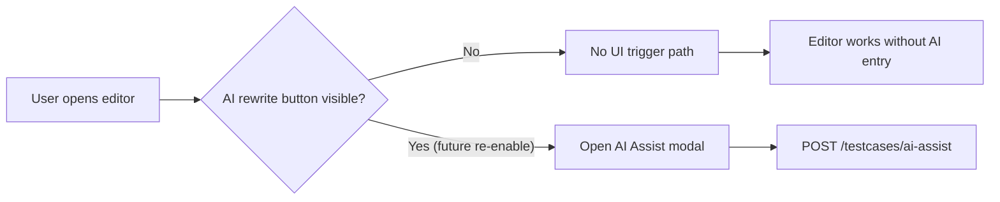

## Context

目前 `test_case_management` 編輯流程有可見的「AI 改寫 / AI Rewrite」入口，會觸發前端 `ai-assist.js` 呼叫 `/api/teams/{team_id}/testcases/ai-assist`。需求是先拿掉所有使用者可見入口，但保留既有 API 與改寫能力，讓未來可快速恢復。

受影響層面包含：
- UI 層：模板按鈕、可能的 toolbar/header 入口、modal 開啟流程。
- 前端邏輯層：按鈕事件綁定、modal lifecycle、錯誤提示流程。
- 後端服務層：AI assist endpoint 與 prompt pipeline（保留不刪除）。

## Goals / Non-Goals

**Goals:**
- 移除全部可見 AI 改寫入口（buttons/actions）且一般使用流程不可直接觸發 AI assist。
- 保留後端 API 與服務邏輯，避免未來恢復功能時需重建。
- 變更範圍侷限於前端資產（template/JS/i18n）以降低風險。

**Non-Goals:**
- 不移除 `app/api/test_cases.py` 內 AI assist endpoint 或 model prompt。
- 不做資料庫變更、不引入新外部依賴。
- 不在本次加入新的權限角色矩陣（RBAC）策略。

## Decisions

### Decision 1: 以「移除/隱藏入口 + 保留 modal 結構」達成最小可回滾成本
- 決策：拿掉可見按鈕與直接入口，保留既有 AI assist modal 結構與 JS 模組檔案。
- Rationale：保留結構可降低未來恢復時間與差異風險。
- Alternatives considered:
  - 完整刪除 AI assist 前後端：不採用，因需求明確要求保留能力。
  - 僅用 CSS 隱藏按鈕：不採用，維運上容易被 DOM 操作繞過且可讀性差。

### Decision 2: 前端事件綁定加防呆，無入口時不初始化 AI flow
- 決策：`ai-assist.js` 僅在入口元素存在時綁定事件，且不暴露可被任意呼叫的全域觸發器。
- Rationale：避免「按鈕拿掉但流程仍可從殘留 hook 觸發」。
- Alternatives considered:
  - 保留現有初始化流程不改：不採用，可能留下非預期觸發路徑。

### Decision 3: API contract 維持不變
- 決策：`/ai-assist` request/response 與錯誤處理維持現況。
- Rationale：符合「保留能力」且避免破壞既有整合或後續內部工具。

## Risks / Trade-offs

- [風險] 有隱藏入口遺漏（例如第二個頁面或次要 toolbar）  
  → Mitigation: 以 `rg` 全域掃描 `AI 改寫|ai-assist|aiAssist` 並逐一核對可見 UI 元件。
- [風險] 測試或文件仍假設按鈕存在  
  → Mitigation: 更新對應測試與使用文件，將 AI 改寫標示為「目前 UI 不開放」。
- [取捨] 保留未使用 UI/JS 會增加少量維護負擔  
  → Mitigation: 在程式註解與 spec 記錄「capability retained, UI hidden」。

## Migration Plan

1. 更新 `test_case_management` 相關 template，移除/隱藏 AI 改寫可見入口。
2. 調整 `ai-assist.js` 初始化守門條件，無入口時不啟動 UI flow。
3. 驗證 `/ai-assist` API 可被內部測試呼叫且行為不變（能力保留）。
4. 回歸檢查編輯器主要功能（非 AI）不受影響。

Rollback strategy:
- 若需恢復，回補 UI 入口並啟用既有事件綁定即可，後端無需回滾。

## Open Questions

- 是否需要保留僅管理員可見的隱性入口（admin-only）？本變更先假設「全部使用者都不顯示」。
- i18n 文案是否暫留（供未來重啟）或同步清理？本設計預設暫留避免 churn。
